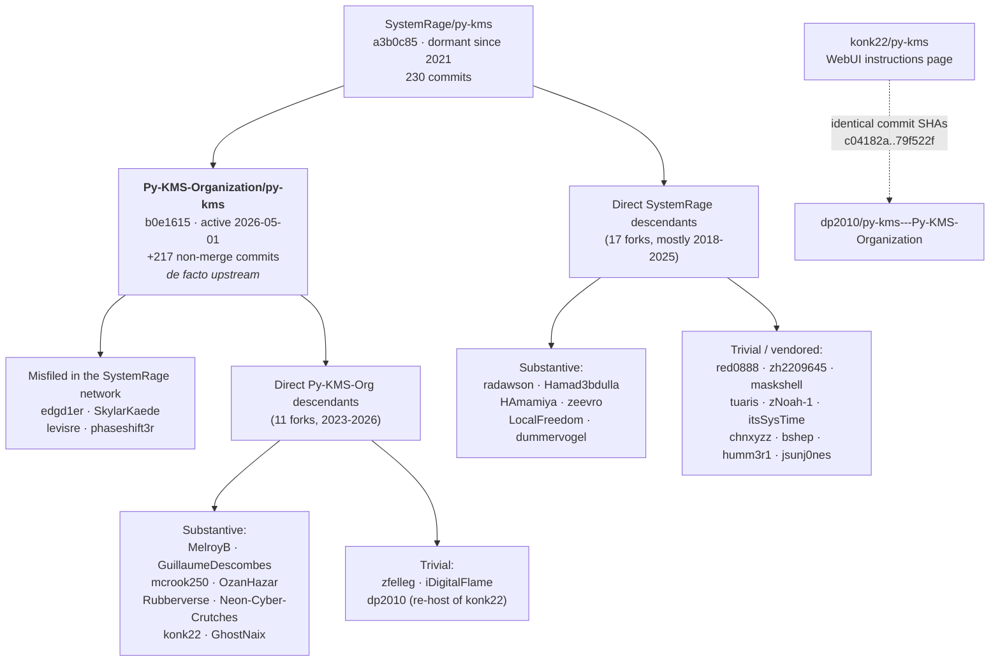

# py-kms fork landscape

An exhaustive audit of the fork network around **SystemRage/py-kms**, the Python KMS emulator,
performed to decide what — if anything — a fresh reimplementation should carry forward.

---

## Headline

**Unlike vlmcsd, this ecosystem is not orphaned.** SystemRage/py-kms has been dormant since 2021
(`origin/master` = `a3b0c85`, 230 commits), but a real, organised, actively maintained successor exists:

> **[Py-KMS-Organization/py-kms](https://github.com/Py-KMS-Organization/py-kms)** — 786 stars, 159 forks,
> 217 non-merge commits ahead of SystemRage, last push **2026-05-01**.

That single fact reorganises the whole analysis. The correct question is not "what did the 21 SystemRage
forks fix?" but "what does Py-KMS-Organization already carry, and does anything else in the network add
value on top of it?"

The answer, stated up front:

- **Py-KMS-Organization/py-kms is the de facto upstream.** It carries nearly every worthwhile fix that the
  independent SystemRage forks discovered, independently and usually better, plus a large amount of original
  work (Flask web UI, SQLite schema migration, modern product data through Windows Server 2025 and Office
  LTSC 2024, Python 3.10–3.13 compatibility, a rebuilt container story, a Helm chart).
- **Four of the "SystemRage forks" are not SystemRage forks at all.** `edgd1er`, `SkylarKaede`, `levisre` and
  `phaseshift3r` are Py-KMS-Organization lineage that GitHub still attributes to the SystemRage network.
  Their apparent 180–277 commit lead is inherited, not authored. Three of them contribute *literally nothing*
  of their own; the fourth contributes one commit.
- **Three forks are byte-identical vendored copies** of a Py-KMS-Organization snapshot (`levisre`, `maskshell`,
  `tuaris`) and one is a byte-identical copy of the source tree onto itself for Heroku (`red0888`).
- **Six forks contain original work worth reading**: `radawson/py-kms-1`, `MelroyB/py-kms`,
  `GuillaumeDescombes/py-kms`, `Hamad3bdulla/py-kms`, `HAmamiya/py-kms`, and `zeevro/py-kms` — though only a
  handful of individual changes from any of them are actually worth porting.
- **A large fraction of the raw diffstat across the entire network is noise**: CRLF↔LF flips, tab↔space
  re-indentation, `black`/`ruff` reformatting, committed `.DS_Store` files, committed backups, and AI-authored
  narrative markdown. Several forks whose diffs look like 2,000–16,000 line rewrites reduce to fewer than ten
  meaningful lines under `git diff -w` or `--ignore-all-space`.

---

## Methodology

### Enumeration

The fork network was enumerated via the GitHub API at two levels, then every code-touching fork was cloned
locally and diffed against the appropriate base.

**Level 1 — SystemRage/py-kms (the nominal upstream):**

| Stage | Count |
|---|---|
| Forks reported by the API | 695 |
| Forks actually listable | 527 |
| Forks with any push after the fork point | 77 |
| Forks ahead of upstream by ≥1 commit | 49 |
| **Forks touching source code** | **21** |

**Level 2 — Py-KMS-Organization/py-kms (the active successor):**

| Stage | Count |
|---|---|
| Stars / forks | 786 / 159 |
| Forks actually listable | 164 |
| Forks ahead of it | 21 |
| **Forks touching source code** | **11** |

**Total analysed in depth: 32 code-touching forks.**

### Diffing

All 32 forks were fetched into a single local clone of `SystemRage/py-kms` as additional remotes, with
`Py-KMS-Organization/py-kms` added as `pykmsorg`. Remote names follow the GitHub `owner/repo` with `/`
replaced by `_` (so `Py-KMS-Organization/py-kms` → remote `Py-KMS-Organization_py-kms`, aliased `pykmsorg`).
Every branch of every fork was enumerated with `git for-each-ref refs/remotes/<remote>` and examined, not just
the default branch — this surfaced several cases where the default branch was empty and all the work lived on
a `next` / `dev` / `Windows-Modification` branch, and several cases where the tip branch was broken and an
older branch was the last working one.

Three diff bases were used depending on lineage:

- `origin/master` (`a3b0c85`) — for genuine SystemRage descendants.
- `pykmsorg/main` (`b0e1615`) — for Py-KMS-Organization descendants.
- **Both** — for the four misfiled forks (`edgd1er`, `SkylarKaede`, `levisre`, `phaseshift3r`), specifically to
  separate inherited work from original work. Without this step, `levisre` looks like a 200-commit / 2,541-line
  contributor; against its real base it is exactly zero.

Where a merge-base was not `origin/master`, that is called out explicitly — several forks branched from a 2018,
2019 or 2020 snapshot and their three-dot diffs systematically understate divergence.

Verification techniques used beyond plain `git diff`:

- `git diff -w` / `--ignore-all-space` to separate whitespace churn from real change.
- Blob-SHA comparison to prove file duplication (`red0888`).
- Tree-SHA comparison to prove a fork is byte-identical to an upstream commit (`maskshell`, `tuaris`).
- `git merge-base --is-ancestor` to prove a fork is a strict ancestor of the successor (`tuaris`).
- Normalised Python token-stream comparison (literals canonicalised, comments and whitespace stripped) across
  all modules to prove a `ruff`/`black` pass was semantics-preserving (`zeevro`, `radawson`).
- Normalised element-by-element XML comparison of `KmsDataBase.xml` to prove data equivalence
  (`GuillaumeDescombes`, `OzanHazar`, `edgd1er`).
- `git grep '^<<<<<<<'` against fork tips to detect committed merge-conflict markers (`phaseshift3r`).
- Reading the tip *tree*, not just the diff, so that "the diff adds X" is never confused with "X is present".

---

## Lineage / family tree

### Inherited vs. original — the critical distinction

Five forks in this network show large "ahead" counts that are entirely inherited. Attribute nothing to them:

| Fork | Reported ahead of SystemRage | Actually original |
|---|---|---|
| `edgd1er/py-kms` | 277 commits / 2,739 churn | **1 commit**, 4 insertions + 3 deletions of source |
| `SkylarKaede/py-kms` | 200 commits / 2,541 churn | **1 commit** (KmsDataBase.xml data, since superseded) |
| `levisre/py-kms` | 200 commits / 2,541 churn | **0 commits** — tree byte-identical to pykmsorg `646f476` |
| `phaseshift3r/py-kms` | 183 commits / 2,534 churn | **3 commits**, all superseded; tip does not parse |
| `maskshell/py-kms` | 126 commits / 81 churn | **0 net** — its 1 commit duplicated a fix already in its own base |
| `tuaris/py-kms` | 90 commits / 36 churn | **0 commits** — strict ancestor of `pykmsorg/main` |

Similarly, `dp2010/py-kms---Py-KMS-Organization` shares seven commit SHAs verbatim with `konk22/py-kms`
(`c04182a`..`79f522f`). Credit that work to **konk22**; `dp2010`'s own three commits only rewrite GHCR image
tags.

---

## Py-KMS-Organization/py-kms — the de facto upstream

**Verdict: substantive-code-changes.** 217 non-merge commits ahead of SystemRage. Diffstat against
`origin/master`: **82 files changed, 2,825 insertions, 4,203 deletions** — a *net deletion*, because the
Tkinter GUI and the Etrigan daemon were removed.

Branches examined: `main` (tip), `next`, `feature/web-ui-update`.
`git diff pykmsorg/next pykmsorg/main` is **empty** — `next` is the development branch that was merged into
`main` at PR #148 with identical tip content; there is no unique work there.
`feature/web-ui-update` is a stale UI-only branch (161 commits ahead of SystemRage, last non-merge commit
2025-10-29) that forked before the `lastRequestIP` work and is *behind* `main` in several respects.

This is the single most important entry in the document, so it gets full treatment.

### 1. Web UI replaces the Tkinter GUI

New module `py-kms/pykms_WebUI.py` (141 lines) implements a Flask app named `pykms_webui`:

| Route | Purpose |
|---|---|
| `/` | Client table read from the SQLite DB |
| `/products` | All KMS products and GVLKs, grouped, with counts and a count of GVLK-less entries |
| `/license` | Renders the `LICENSE` file |
| `/readyz` | Kubernetes startup probe |
| `/livez` | Kubernetes liveness probe |

Configuration is **environment-only**, not CLI:

- `PYKMS_SQLITE_DB_PATH` — required; the app returns HTTP 500/503 if unset.
- `PYKMS_LICENSE_PATH` — default `../LICENSE`.
- `PYKMS_VERSION_PATH` — default `../VERSION` (build metadata written at image build time).

Templates live in `py-kms/templates/` (`base.html`, `clients.html`, `products.html`, `license.html`) and
Bulma CSS is vendored at `py-kms/static/css/bulma.min.css`. It is served by **gunicorn on port 8080**, started
by `docker/start.py:70-77` **only when `WEBUI=1`**. This is effectively container-only: running it outside
Docker requires launching gunicorn by hand.

In exchange, the following were **deleted**:

- `py-kms/pykms_GuiBase.py` (948 lines)
- `py-kms/pykms_GuiMisc.py` (517 lines)
- The five GIF assets under `py-kms/graphics/`
- `LICENSE.gui.md`
- GUI hooks in `pykms_Format.py` (`gui_redirector`, `gui_redirector_setup`, `gui_redirector_clear`)
- The `serverthread.with_gui` log-format branch in `pykms_Misc.py`

Commits: `03c3e1c`, `28e07ac`, `0cb3ee5`, `f1fa5b7`.

### 2. Etrigan daemon mode removed entirely

`py-kms/Etrigan.py` (609 lines) is deleted, along with:

- the `etrigan` subparser and its `start|stop|restart|status` positional operation
- `server_daemon()`, `Etrigan_Check` / `Etrigan` subclasses
- the pickle-based config persistence in `gettempdir()/pykms_config.pickle`
- the `-g/--gui` flag
- `--etrigan-pid`, `--etrigan-log`, `--etrigan-lev`, `--etrigan-mute`

`__main__` no longer branches on `sys.stdout.isatty()`; it unconditionally calls `server_main_terminal()`
(`py-kms/pykms_Server.py:536-543`). Users are directed at systemd or Docker.

Side benefit: this removes a **pickle-deserialisation attack surface** — the old code loaded a pickle from a
world-writable temp directory on `stop`/`status`/`restart`. Commits `77e545d`, `4bd6095`.

### 3. SQLite layer rewritten with schema migration

`py-kms/pykms_Sql.py` is rewritten from the ground up (`py-kms/pykms_Sql.py:1-131`):

- `sqlite3` availability is a module-level `available` flag (`py-kms/pykms_Sql.py:13-18`) instead of a
  swallowed `ImportError`; every entry point short-circuits on it.
- `sql_initialize()` is now called **once at startup** from `server_check()` (`py-kms/pykms_Server.py:374-386`)
  rather than on every request from `kmsBase` (`py-kms/pykms_Base.py:212-215`).
- The `clients` table gains `PRIMARY KEY(clientMachineId, applicationId)` — upstream had **no primary key**.
- A `metadata` key/value table stores `schema_version`; migrations are applied on every start. Version 1 adds
  the `lastRequestIP TEXT` column via `ALTER TABLE`. This is a genuine in-place migration, not a
  create-if-absent.
- Every `SELECT *` + positional indexing (`data[1]`, `data[2]`, …) is replaced by an explicit
  `_column_names` tuple and `sqlite3.Row` named access, so column reordering can no longer corrupt reads;
  unknown column names raise `ValueError`.
- `sql_update()` validates that `infoDict` contains every required column and raises `ValueError` otherwise.
- Connections use `with sqlite3.connect(...)` context managers instead of manual commit/close.
- SQLite errors are no longer swallowed into a `to_exit=True` `pretty_printer`.
- New `sql_get_all()` returns every client row as a list of dicts with `lastRequestTime` converted to ISO 8601,
  for the web UI.

Commits `2baf218`, `ba9d1f0`, `9c83557`, `ca7ba46`.

### 4. `infoDict` key rename and new fields (coordinated schema + code change)

`kmsBase.serverLogic()` (`py-kms/pykms_Base.py:165-215`) now emits:

| Old key | New key |
|---|---|
| `appId` | `applicationId` |
| `requestTime` | `lastRequestTime` |
| — | `lastRequestIP` (from `self.srv_config['raddr'][0]`) |

`appName`/`skuName` are pre-seeded with `str(applicationId)` / `str(skuId)`, so an unknown product no longer
raises `UnboundLocalError` before the database write. (This is the same defect that `humm3r1` and
`LocalFreedom` independently one-lined; upstream fixed it properly.) The renamed keys are the SQL bind
parameters, so schema and code must move together.

### 5. Default listen address flipped to IPv6 dual-stack

**Behaviour change.**

| Option | SystemRage default | Py-KMS-Org default | Location |
|---|---|---|---|
| `ip` (server) | `0.0.0.0` | `::` | `py-kms/pykms_Server.py:191` |
| `ip` (client) | `0.0.0.0` | `::` | `py-kms/pykms_Client.py:58` |
| `-d/--dual` | `False`, `action='store_true'` | `True`, `type=_str2bool` | `py-kms/pykms_Server.py:226`, `:273` |

`_str2bool` (`py-kms/pykms_Server.py:137-146`) accepts `yes/true/t/y/1` and `no/false/f/n/0` and raises
`ValueError` on anything else — so `-d` now **requires an explicit value**, which is a CLI-breaking change for
anyone scripting the old flag. The container sets `ENV IP=::` and `ENV DUALSTACK=1`, and `docker/start.py:49-53`
only forwards `-d` when extra listen addresses are configured. `docs/Usage.md` documents that hosts without
IPv6 must explicitly pass `0.0.0.0`.

Commits `d8c1d75`, `57f2159`, `a9b17ad`, `da7feff`.

### 6. Full option-default deltas

Read from `py-kms/pykms_Server.py` `srv_options` on `pykmsorg/main`:

| Option | Flag | Default | Note |
|---|---|---|---|
| `ip` | positional | `::` | was `0.0.0.0` |
| `port` | positional | `1688` | unchanged |
| `epid` | `-e/--epid` | `None` | unchanged |
| `lcid` | `-l/--lcid` | `1033` | unchanged |
| `count` | `-c/--client-count` | `None` | unchanged |
| `activation` | `-a/--activation-interval` | `120` (min) | unchanged |
| `renewal` | `-r/--renewal-interval` | `10080` (min, = `1440*7`) | unchanged |
| `sql` | `-s/--sqlite` | `False`, `type=str` | **semantics changed: now a file, not a directory** |
| `hwid` | `-w/--hwid` | **`RANDOM`** | was the fixed `364F463A8863D35F` |
| `time0` | `-t0/--timeout-idle` | `None` | unchanged |
| `time1` | `-t1/--timeout-sndrcv` | `None` | unchanged |
| `asyncmsg` | `-y/--async-msg` | `False` | retained (unlike `radawson`, which deleted it) |
| `llevel` | `-V/--loglevel` | **`WARNING`** | was `ERROR` |
| `lfile` | `-F/--logfile` | `./pykms_logserver.log` | unchanged |
| `lsize` | `-S/--logsize` | `0` (off) | unchanged |
| `backlog` | `--backlog` | `5` | unchanged |
| `reuse` | `--reuse` | `True` | unchanged |
| `dual` | `-d/--dual` | **`True`** | was `False`; now takes a value |

**Documented-vs-code mismatch:** `docs/Usage.md:233-241` still says the log level default is `"ERROR"` in the
Docker ENV section, contradicting the code's `WARNING`. The container overrides it with `LOGLEVEL=INFO` anyway.

`-s/--sqlite` deserves its own note. It used to be validated with `check_dir(..., typefile='.db')` and treated
as a *directory*; it now points directly at the database file (`py-kms/pykms_Server.py:243-244`, `:374-386`).
Passing a directory still works but emits a deprecation warning and appends `pykms_database.db`. `check_dir()`
lost its `typefile` parameter and the branch that fatally exited when a log/DB filename lacked the expected
extension (`py-kms/pykms_Misc.py:227-243`), so **arbitrary log filenames are now accepted**. Commits `f15ed48`,
`5de292e`, `92ec80b`, `964dde6`.

### 7. Bug fixes

**`SO_REUSEPORT` on unsupported platforms is a warning, not a fatal error.** `create_server_sock()` previously
raised `ValueError('SO_REUSEPORT not supported on this platform')`, killing startup on Windows. It now emits a
warning through `pretty_printer` and sets `reuse_port = False` (`py-kms/pykms_Connect.py:38-40`). The related
Windows Sandbox hack (forcing reuse off when `getpass.getuser() == 'WDAGUtilityAccount'`) was removed from
`server_create()` (`py-kms/pykms_Server.py:419-428`) as no longer needed. Commit `11e8b4d`.

**Python 3.10–3.13 compatibility.** Several removed/deprecated APIs replaced:

| Old | New | Location |
|---|---|---|
| `threading.Thread.setDaemon()` | `.daemon` | `py-kms/pykms_Server.py:539` |
| `datetime.datetime.utcnow()` | `datetime.now(datetime.timezone.utc)` | `py-kms/pykms_Client.py:331` |
| `tz.localize(dt)` | `datetime.fromisoformat(str(dt)).astimezone(get_localzone())` | `py-kms/pykms_Base.py:119-138` |
| `random.randint(float, float)` | `int()`-wrapped bounds | `py-kms/pykms_PidGenerator.py:66` |
| `'\(.*\)'` | `r'\(.*\)'` (raw string) | `py-kms/pykms_Client.py:173` |

`setDaemon` was removed in 3.13; `tzlocal` 4+ returns a `zoneinfo` object with no `.localize`. A broad `except`
around timezone localisation keeps the server alive if anything else in that path fails. Commits `4c1d7b5`,
`7350ba1`, `4a7376f`.

**ePID generator made tolerant of incomplete DB entries.** `epidGenerator()` (`py-kms/pykms_PidGenerator.py:20-66`)
previously required every `CsvlkItem` to carry `InvalidWinBuild` and every `WinBuild` to carry `MinDate` in
`DD/MM/YYYY` form, parsed with `strptime`. Both are now optional:
`csvlkitem.get('InvalidWinBuild', '[]')` supplies a default, a new `except KeyError: pass` skips malformed
entries entirely, and the date field is renamed to `ReleaseDate` in ISO 8601 (`2018-10-02T00:00:00Z`), parsed
with `datetime.fromisoformat` after stripping the trailing `Z`. `NCountPolicy` also became optional on the
client side, defaulting to 25 (`py-kms/pykms_Client.py:184`). The `KeyError` guard specifically fixes
**Windows Server 2019 activation failing** because of an incomplete `KmsDataBase.xml` entry. Commits `2ef5864`,
`71f31d4`, `ecf50e0`.

The *host-build* loop was left keyed on the now-deleted `WinBuildIndex` attribute, which turns its own
`except KeyError` into an unconditional fallback — see the critical-defect note at the end of §8.

**Client product lookup made strict and Windows 11 aware.** `client_update()` (`py-kms/pykms_Client.py:164-192`)
previously matched on a name mangled with `re.sub('\(.*\)','')` plus a `'2015'`/space strip, and silently left
`clt_config` half-populated when nothing matched (`break` only exited the inner loop). It now also strips the
first `/11` from both `KmsItem` and `SkuItem` display names (so the renamed `Windows 10/11 …` entries still
match modes like `Windows10`), returns immediately on a match, and **raises `RuntimeError` naming the searched
mode** when no entry is found.

**Request exceptions are logged instead of silently discarded.** `KeyServer.handle_error()` was `pass` — every
handler exception swallowed. It now logs the client address and `traceback.format_exc()` at error level
(`py-kms/pykms_Server.py:126-128`). Conversely, `"No data received."` moved from warning to debug because the
container healthcheck opens and closes a TCP connection every 5 minutes and was spamming the log
(`py-kms/pykms_Server.py:491-493`). Commits `a5502e5`, `6da4791`.

**Graceful shutdown.** `server_main_terminal()` polls `serverthread.join(timeout=0.5)` inside a
`try/except (KeyboardInterrupt, SystemExit)` so Ctrl+C reliably reaches
`server_terminate(exit_server=True, exit_thread=True)` instead of hanging on a blocking join
(`py-kms/pykms_Server.py:468-480`); `docker/entrypoint.py:84-90` installs a SIGTERM handler so `docker stop`
terminates both the KMS process and gunicorn cleanly. Commits `28faacd`, `c216e50`.

### 8. Product database — the single biggest reason to use this fork

`py-kms/KmsDataBase.xml` was substantially rewritten. Windows side:

- **New `KmsItem` "Windows Server 2022"** (Id `b74263e4-0f92-46c6-bcf8-c11d5efe2959`, protocol 6.0,
  NCountPolicy 5) with 6 SKUs including Datacenter `WX4NM-KYWYW-QJJR4-XV3QB-6VM33`, Standard
  `VDYBN-27WPP-V4HQT-9VMD4-VMK7H`, Datacenter Azure Edition `NTBV8-9K7Q8-V27C6-M2BTV-KHMXV`, Azure Core, and
  the Semi-Annual Channel variants.
- **New `KmsItem` "Windows Server 2025"** (Id `4b83307d-7788-50ff-8d1f-1861915bdb9d`) with Datacenter
  `D764K-2NDRG-47T6Q-P8T8W-YP6DF`, Standard `TVRH6-WHNXV-R9WG3-9XRFY-MY832`, Datacenter Azure Edition
  `NQ8HH-FTDTM-6VGY7-TQ3DV-XFBV2`, Azure Core.
- **New `KmsItem` "Windows Server Next (Preview)"** with 4 SKUs.
- **New `CsvlkItem`s**: Windows Server 2022 (GroupId 4573, Id `661f7658-…`, `MaxKeyId` corrected from 49999 to
  20029999 in commit `2a3e3fa`), Windows Server 2022 Azure-only (4574), Windows Server 2022 Internal Lab (4575),
  Windows Server 2025 (4918), Windows Server 2025 Azure-only (4919), Windows Server 2025 Internal Lab (4920),
  Windows Server 2019 (Azure Only).
- **12 new `WinBuild` rows**: 18362, 18363, 19041, 19042, 19043, 19044, 20348 (Server 2022 21H2, `UseForEpid`),
  20349 (Server 2022 22H2), 22000, 22621, 22631, 26100 (Windows 11 24H2 / Server 2025, `UseForEpid`).
- `Windows 10 (Retail)` and `Windows 10 2015 (Volume)` renamed to `Windows 10/11 …` and extended with
  Windows 11 SE (`37D7F-N49CB-WQR8W-TBJ73-FM8RX`), Windows 11 SE N, Windows 10/11 IoT Enterprise LTSC
  2021–2024 (`KBN8V-HFGQ4-MGXVD-347P6-PDQGT`).
- **New `KmsItem` "Windows 10 ServerRdsh (Volume)"** carrying Windows 10/11 Enterprise multi-session
  (`CPWHC-NT2C7-VYW78-DHDB2-PG3GK`).

Office side — the AppItem was renamed to `Office 2013 / 2016 / 2019 / LTSC 2021 / LTSC 2024` and gained:

- **`KmsItem` "Office 2021"** (Id `86d50b16-4808-41af-b83b-b338274318b2`, 16 SKUs, incl. Office LTSC
  Professional Plus 2021 `FXYTK-NJJ8C-GB6DW-3DYQT-6F7TH`).
- **`KmsItem` "Office 2024"** (Id `1b4db7eb-4057-5ddf-91e0-36dec72071f5`, 15 SKUs, incl. Office LTSC
  Professional Plus 2024 `XJ2XN-FW8RK-P4HMP-DKDBV-GCVGB`).
- **`CsvlkItem` "Office LTSC 2021"** (Id `47f3b983-…`, GroupId 206, key range 571000000–590999999).
- **`CsvlkItem` "Office LTSC 2024"** (Id `f3d89bbf-…`, key range 666000000–685999999).

Cleanup: the empty-GVLK preview placeholder `KmsItem`s (Windows Vista Preview, Windows 7 Client/Server Preview,
Windows Longhorn Server Preview ×3, Windows Next Preview 1/2, Windows Next Education Preview, Windows Preview)
were dropped. **Total SKU count went from 296 → 257 while the number of *usable* GVLKs rose.**

> **Known wart:** the Office 2024 `KmsItem` has a typo in its attribute name — `DefaultKmsprotocol` instead of
> `DefaultKmsProtocol`.

> **Critical defect — the new build catalog is never used. Every Organization-fork ePID claims build
> 17763.** The v2.0 database dropped the `WinBuildIndex` attribute in favour of `UseForEpid` +
> `ReleaseDate`: all **30** `WinBuild` rows in `pykmsorg/main`'s `py-kms/KmsDataBase.xml` now lack
> `WinBuildIndex` (SystemRage's v1.7 had 6 of 18 carrying it). But `epidGenerator()` still keys the
> host-build loop on that attribute — `if int(winbuild['WinBuildIndex']) not in Invalid:`
> (`pykmsorg py-kms/pykms_PidGenerator.py:42`). Every one of the 30 rows therefore raises `KeyError`
> and takes the fallback branch at `:46`, which appends the hardcoded literal
> `{'BuildNumber':'17763', 'PlatformId':'3612', 'ReleaseDate':'2018-10-02T00:00:00Z'}`. `hosts` ends
> up as 30 identical copies of that dict, so `random.choice(hosts)` is a no-op.
>
> Measured against the checked-out fork: 2,000 generations for Windows Server 2019 produced
> `17763.0000` **2,000 times**, and Office 2010 yields ePIDs such as
> `03612-00206-553-241045-03-1033-17763.0000-3422020`. The 12 new `WinBuild` rows this fork added —
> including 20348 and 26100, both flagged `UseForEpid="true"` — are dead data. Every ePID the
> successor emits advertises Windows 10 1809 / Server 2019, platform 3612, regardless of the product
> requested and regardless of the modern catalog the fork exists to ship. The `UseForEpid` flag is
> read by no code at all.
>
> This is strictly worse than upstream, where 6 of 18 builds *did* carry an index and could be
> selected (upstream still hit the same fallback 12 times out of 18, hence its ~86 % skew — see
> `py-kms-features.md` §7.4). The fix is one line: key the loop on `UseForEpid` (or on the row's
> position in the list) instead of `WinBuildIndex`.

Commits: `1384dc7`, `525f8e9`, `c3ae9a9`, `0ac968c`, `9bdc0e4`, `2a3e3fa`, `d056610`, `0c0e345`, `ef73542`,
`dfbfed8`, `9c44b6e`, `7935b09`, `b0b3a62`.

### 9. DNS SRV auto-discovery in the test client

`pykms_Client.py` gained `-D/--discovery <domain>` (default `None`). When set, `client_connect()` resolves
`_vlmcs._tcp.<domain>` SRV via `dns.resolver`, logs every answer at DEBUG, and takes the first record's target
(resolved through `socket.gethostbyname`) and port as `clt_config['ip']` and `['port']`
(`py-kms/pykms_Client.py:16-21`, `:80`, `:108-109`, `:195-208`). `dns.exception.Timeout` and
`dns.resolver.NXDOMAIN` are caught and downgraded to a warning, falling through to the configured address.

`dnspython` is imported **unconditionally at module top**, so it is now a hard dependency of the client —
`dnspython==2.8.0` in `docker/docker-py3-kms/requirements.txt`, `2.6.1` in the minimal image. Commits `805c234`,
`c74a64c`, `248c144`.

### 10. Container runtime rewritten

Removed: `start.sh`, `run-py3-kms.sh`, `build-py3-kms.sh`, the four per-architecture Dockerfiles (amd64,
arm32v6, arm32v7, arm64v8) for **both** images, the docker-hub `hooks/pre_build` + `hooks/post_push`, and the
multi-arch manifest YAMLs.

Added: one `Dockerfile` per image (full and minimal, `alpine:3.22`) built by `buildx bake`, plus three Python
scripts:

- **`docker/entrypoint.py`** (1–90) — runs as root, sets `TZ` via `time.tzset()`, chowns `/home/py-kms` and
  recursively fixes ownership/permissions on the DB directory (0700 dirs, 0600 files), then `os.setgid` /
  `os.setuid` to `UID`/`GID` (defaults from the baked-in `py-kms` user), skipping the drop entirely if already
  correct or if not root. Installs a SIGTERM handler.
- **`docker/start.py`** (1–99) — maps environment to server flags: `-l LCID`, `-c CLIENT_COUNT`,
  `-a ACTIVATION_INTERVAL`, `-r RENEWAL_INTERVAL`, `-w HWID`, `-V LOGLEVEL`, `-F LOGFILE`, `-S LOGSIZE`,
  `-e EPID`. `IP` may contain several space-separated addresses which become `connect -n ip,port` entries;
  `DUALSTACK` is passed as `-d <value>`. When `WEBUI=1` it adds `-s /home/py-kms/db/pykms_database.db` and
  spawns gunicorn on 8080 with `PYKMS_SQLITE_DB_PATH` / `PYKMS_LICENSE_PATH` / `PYKMS_VERSION_PATH` set.
- **`docker/healthcheck.py`** (1–37) — replaces the netcat probe; tries `127.0.0.1` first, then every address
  in `IP`, using `AF_INET6` when the address contains a colon, with a 1 second timeout.

New container environment variables: `WEBUI`, `DUALSTACK`, `UID`, `GID`, `TZ`.
Images are hardened with 0444 files / 0555 dirs owned by root and a 1777 db directory, and tagged with
`BUILD_COMMIT` / `BUILD_REFERENCE` written to `/VERSION` for the web UI footer. Distribution moved from Docker
Hub to **`ghcr.io/py-kms-organization/py-kms`**. Commits `0630b22`, `d2394cd`, `c216e50`, `474c5fe`, `94419c1`,
`7490ba9`, `2d37400`.

**Removed capability:** the old container shipped `sqlite-web` gated behind `ENV SQLITE=true`, with a fallback
that blocked `SQLITE` if the sqlite-web files were missing. Both the dependency and the `SQLITE` environment
variable were deleted, superseded by the built-in web UI. Anyone relying on the sqlite-web browser loses it.
Commits `5a8a21a`, `eb42224`.

### 11. Helm chart

`charts/py-kms` deploys `ghcr.io/py-kms-organization/py-kms:python3` with configurable `replicaCount`, `image`,
`imagePullSecrets`, and a `py-kms.environment` map (defaults `LOGLEVEL=INFO`, `LOGSIZE=2`,
`LOGFILE=/var/log/py-kms.log`, `HWID=RANDOM`, `IP='::'`). Ships a ClusterIP service exposing `httpPort` 80 and
`kmsPort` 1688, optional ingress, optional HPA, serviceAccount, node selector / tolerations / affinity, and a
test-connection hook. Container ports `kms/1688` and `http/8080` are wired to a `startupProbe` on `/readyz`
(30 failures, 1 s period) and a `livenessProbe` on `/livez` (20 s period) — **which is why those endpoints exist
in the web UI at all** (`charts/py-kms/templates/deployment.yaml:44-60`). Commits `f7062f7`, `83a1638`,
`6f5b743`, `98e0900`, `dfbeee6`.

### 12. CI

`.github/workflows/test_basic_client.yml` starts `pykms_Server.py -s ./pykms_database.db` under `timeout 30`
and runs `pykms_Client.py` three times — once with a random CMID and twice with a fixed CMID
`174f5409-0624-4ce3-b209-adde1091956b` — to exercise both the INSERT and the UPDATE paths of the rewritten SQL
layer. Also `test_image_build.yml` and three `buildx bake` workflows (`bake_to_latest`, `bake_to_next`,
`bake_to_version`) for multi-arch publishing to GHCR. Commits `24b2630`, `cd7cbd1`, `f88ada3`.

### 13. The `feature/web-ui-update` branch (stale, do not treat as current)

161 commits ahead of SystemRage, last non-merge commit 2025-10-29, forked **before** the `lastRequestIP` work.
Diffing it against `main` shows regressions: its `clients.html` lacks the "Last Address" column, its
`KmsDataBase.xml` is older, and its version footer says "branch" not "reference".

Its genuinely unique work is UI-only and **not merged into `main`**:

- A `/instructions` route and `templates/instructions.html` with `slmgr`/`ospp` activation walkthroughs.
- A live client-side search box filtering the products table.
- A per-row clipboard-copy button using `navigator.clipboard` with success/failure styling.
- A navbar (Home / Instructions) and a scroll-to-top button.
- `static/css/styles.css` and six WebP screenshots.

It also **flattens** `_get_kms_items_cache()` from a grouped `{group -> {product -> gvlk}}` dict back to a flat
`{product -> gvlk}` dict via a BFS queue, dropping the product grouping that `main` has
(`py-kms/pykms_WebUI.py:18-44`, `:140-149` on that branch). Commits `79f522f`, `aa2ab92`, `c04182a`, `40fb972`.

Note the overlap: this is the same feature set that **`konk22/py-kms`** developed independently (and that
`dp2010` re-hosted). Neither has landed on `main`.

### 14. Docs and dependency churn (not substantive)

The remaining large chunk of the diffstat is documentation and packaging: README rewritten and re-badged for
the new org, `CHANGELOG.md` moved to `docs/Historic Releases.md`, `docs/Keys.md` regenerated as tables,
migration from `recommonmark` to `myst-parser` plus a `.readthedocs.yaml`, `docs/requirements.txt` and
Flask/Jinja2/Pygments/urllib3/Babel version bumps, dependabot commits, `.dockerignore` and `.gitignore`, and
GitHub Actions job relabelling. No behaviour change in any of it. Commits `291bb62`, `4482b62`, `0d59182`,
`4acd86d`, `1b4f0a9`, `94bcba3`, `a981e4a`, `6dcd059`, `73a80ba`, `df0b7d3`, `047bff1`.

---

## Summary table — all 32 code-touching forks

Verdicts: **substantive** = real original code changes worth reading; **bugfix-only** = correct but small;
**packaging/docs** = no meaningful source change; **vendored copy** = contributes literally nothing;
**trivial** = one or two lines of marginal value.

`Ahead` is commits ahead of the stated base on the branch examined, **counting merge commits** — with one
exception: **Py-KMS-Organization/py-kms**, whose 217 is the *non-merge* count (276 including merges), because
the 59 merges are its own PR merges of its own branches. `Churn` is code-file line churn from the enumeration
pass, against SystemRage for the first block and against Py-KMS-Org for the second.

### Descendants of SystemRage/py-kms

| Fork | Base compared | Last activity | Ahead | Churn | Verdict | What it is |
|---|---|---|---|---|---|---|
| **Py-KMS-Organization/py-kms** | `origin/master` | 2026-05-01 | 217 | 2739 | **substantive** | The living successor; web UI, modern product DB, Py3.13 support, containers, Helm |
| radawson/py-kms-1 | `origin/master` | 2025-05-10 | 89 | 4748 | **substantive** | Flask dashboard + SQLAlchemy multi-DB + YAML config; tip branch `aes` is broken |
| edgd1er/py-kms | **`pykmsorg/main`** | 2026-07-22 | **1** | 2739 | packaging | Multi-stage Dockerfile + Makefile + lint CI; 2 one-line source fixes |
| SkylarKaede/py-kms | **`pykmsorg/main`** | 2025-01-06 | **1** | 2541 | substantive (data) | WS2025 + Office 2024 GVLKs, hand-assembled with wrong IDs; superseded |
| levisre/py-kms | **`pykmsorg/main`** | 2024-05-28 | **0** | 2541 | **vendored copy** | Byte-identical to pykmsorg `646f476`. Nothing. |
| phaseshift3r/py-kms | **`pykmsorg/main`** | 2023-12-17 | 4 | 2534 | bugfix-only | Two 2022 fixes; **tip has unresolved conflict markers, does not run** |
| maskshell/py-kms | `origin/master` + `pykmsorg` | 2022-06-23 | 126 | 81 | **vendored copy** | Tree identical to pykmsorg `1435c86`; its one commit duplicated its own base |
| tuaris/py-kms | `origin/master` + `pykmsorg` | 2021-12-10 | 90 | 36 | **vendored copy** | Strict ancestor of `pykmsorg/main`. Nothing. |
| Hamad3bdulla/py-kms | `origin/master` (real base `9d9a363`) | 2026-02-04 | 10 | 3196 | **substantive** | 2026 AI-assisted modernisation of a 2020 snapshot; real ePID fix, dead-code traps |
| zeevro/py-kms | `origin/master` | 2026-06-21 | 8 | 16016 | packaging | src-layout pip package + whole-tree `ruff`; 3 real lines of behaviour change |
| zh2209645/py-kms | `origin/master` (2018 base) | 2018-12-04 | 7 | 156 | bugfix-only | Guards for wildcard/empty UUIDs in the 2018-era DB; obsolete |
| chnxyzz/py-kms | `origin/master` | 2020-10-12 | 7 | 4 | trivial | One `time.sleep(0.3)`; rest is `.DS_Store` and personal KMS host scripts |
| red0888/py-kms | `origin/master` | 2021-08-01 | 6 | 8235 | **vendored copy** | Heroku: the source tree duplicated at repo root, byte-identical |
| HAmamiya/py-kms | `origin/master` (2018 base) | 2019-03-30 | 6 | 7076 | **substantive** | Per-(client,SKU) DB rows + hostname allowlist that crashes the whole server |
| LocalFreedom/py-kms | `origin/master` | 2025-01-30 | 5 | 8 | **substantive (data)** | WS2022/WS2025 + Office LTSC 2021 GVLKs, Py3.10 fixes, NameError fix |
| bshep/py-kms | `origin/master` | 2019-09-08 | 3 | 2 | trivial | `time.sleep(0.1)` + Dockerfile clone URL |
| itsSysTime/py-kms-fixed | `origin/master` | 2025-07-20 | 3 | 6 | bugfix-only | 6 lines: `collections.abc`, `Thread.daemon` |
| humm3r1/py-kms | `origin/master` | 2021-08-17 | 2 | 2 | bugfix-only | One line seeding `appName`/`skuName`; README claims WS2022 support |
| jsunj0nes/py-kms | `origin/master` | 2020-07-14 | 2 | 2 | trivial | Two lines; one is a Docker regression |
| dummervogel/py-kms | `origin/master` | 2020-07-11 | 1 | 13 | substantive (hack) | Forces AF_INET and disables the self-pipe so it runs on Windows |
| zNoah-1/py-kms | `origin/master` | 2022-11-19 | 1 | 7 | bugfix-only | Version-gated `collections.abc` import — best variant of that fix |

### Descendants of Py-KMS-Organization/py-kms

| Fork | Base compared | Last activity | Ahead | Churn | Verdict | What it is |
|---|---|---|---|---|---|---|
| Rubberverse/qor-kms | `pykmsorg/main` | 2026-04-23 | 55 | 16 | **substantive** | "RVS_KMS" rebrand; Polish WebUI, single root Dockerfile, real DB edits |
| MelroyB/py-kms | `pykmsorg/main` (base `db7409b`) | 2026-03-16 | 38 | 1934 | **substantive** | WebUI auth + CSRF + IP blacklist + GeoIP + Docker self-update |
| dp2010/py-kms---… | `pykmsorg/main` | 2025-05-11 | 11 | 16 | packaging | Re-host of konk22's work; own commits only rewrite GHCR tags |
| GuillaumeDescombes/py-kms | `pykmsorg/main` | 2025-12-06 | 9 | 168 | **substantive** | Client allowlist gate on V5, re-keyed schema, hardened RPC receive loop |
| GhostNaix/py-kms-windows | `pykmsorg/main` | 2024-10-17 | 8 | 3 | substantive (port) | Windows desktop port: colorama + `.bat` launchers + waitress |
| konk22/py-kms | `pykmsorg/main` | 2024-08-04 | 7 | 16 | **substantive (UI)** | WebUI `/instructions` page, product search, clipboard copy |
| Neon-Cyber-Crutches/py-kms-metrics | `pykmsorg/main` | 2026-06-26 | 6 | 296 | **substantive** | Prometheus exporter — architecturally broken (wrong process) |
| mcrook250/ms-kms | `pykmsorg/main` (base `465f4d1`) | 2025-06-26 | 4 | 525 | **substantive** | AUTO_PURGE thread, `/status` page, source IP; DB swap is a regression |
| zfelleg/py-kms | `pykmsorg/main` (base `599574b`) | 2023-11-12 | 3 | 342 | bugfix-only | Three Py3.12 fixes; 165 of 171 diff lines are trailing whitespace |
| OzanHazar/py-kms | `pykmsorg/main` | 2025-08-28 | 3 | 98 | **substantive** | Per-SKU activation quota — three guaranteed `NameError` paths |
| iDigitalFlame/py-kms | `pykmsorg/main` | 2024-07-18 | 1 | 14 | bugfix-only | `random.randint` int fix — already upstream via PR #119 |

---

## Per-fork analysis — substantive forks

### radawson/py-kms-1 — Flask dashboard + SQLAlchemy + YAML config

**Base:** `origin/master` (`a3b0c85`). **Ahead:** 89. **Last activity:** 2025-05-10.
**Branches:** `master`, `aes`, `SQL`, `dev`.

The most heavily-modified genuine SystemRage descendant. Richard Dawson bolted a full deployment stack onto
py-kms. **A large part of the raw diff is `black`-style reformatting, not behaviour** —
`py-kms/pykms_RequestV5.py` shows 405 changed lines but is almost entirely 8-space→4-space re-indentation and
single→double quote conversion (`6f88c30`, `cfa0489`), and `pykms_Server.py`'s 1,616-line diff is dominated by
black-style argparse re-wrapping. `KmsDataBase.xml` shows a 2,150-line diff between the `SQL` and `master`
branches that is *purely a CRLF/LF flip* — `git diff --ignore-all-space` between them produces no hunks for
that file.

**Branch selection matters.** The tip branch `aes` is **broken**:

> `py-kms/pykms_Aes.py` on `radawson_py-kms-1/aes` is replaced by a python-`cryptography` wrapper (the old file
> kept as `pykms_Aes.old.py`). Three hard breaks: (1) `AESModeOfOperation.encrypt()` now returns plain `bytes`,
> but all three call sites still do `mode, orig_len, crypted = moo.encrypt(...)` — a guaranteed `ValueError` on
> every activation (`py-kms/pykms_RequestV5.py:141`, `:223`, `py-kms/pykms_RequestV6.py:96`). (2) `decrypt()`
> type-checks `isinstance(cipherIn_bytes, bytes)` while callers pass a `bytearray`, raising `TypeError` first.
> (3) **The KMS-v6 modified AES is gone entirely** — the replacement's own comment says "No v6 flag, Sbox, Rcon,
> or manual round implementations. Standard AES is used", so the `state[0] ^= 0x73 / 0x09 / 0xE4` XORs at rounds
> 4/6/8 that KMS protocol 6 requires are silently dropped and `moo.aes.v6 = self.v6` becomes a no-op attribute.
> Compare `py-kms/pykms_Aes.py:290-322` on `origin/master`. Branch `SQL` explicitly *reverted* the same import
> switch (`31764ef`).

**`master` (2025-05-06) is the last working tip.**

What is genuinely here:

- **Flask web dashboard** (`py-kms/pykms_WebGui.py` + five Jinja templates). Routes `/` (activation stats +
  last-7-days recent activations, deduplicated by `(clientMachineId, applicationId)`, capped at 10),
  `/clients`, `/config` (GET renders, POST writes `config.yaml`), `/logs`, `/api/logs` (tails last 100 lines),
  `/api/notifications`, `/api/notifications/resolve/<id>`. Runtime flags `-wg/--web-gui` (store_true, default
  `False`) and `-wp/--web-port` (default 8080), started in a daemon thread from `server_check()`
  (`py-kms/pykms_Server.py:844-872`, `:480-495`).
  **Security, grounded in the code:** the listener is hardcoded to `host='0.0.0.0'` regardless of the KMS bind
  address; there is **no authentication and no CSRF protection of any kind**; the `/config` page renders and the
  POST handler rewrites database credentials (`db_user`, `db_password`); and `save_config()` writes them in
  **cleartext** to `py-kms/config.yaml`. `init_web_gui()` also calls `create_backend(config)` twice, creating
  two SQLAlchemy engines.
- **SQLAlchemy persistence layer** (`py-kms/pykms_Database.py`). Declarative `Client` model (clientMachineId,
  machineName, applicationId, applicationName, skuId, skuName, licenseStatus, lastRequestTime, kmsEpid,
  requestCount, `ipAddress(45)` for IPv4/IPv6) and an `UnknownActivation` model. A custom
  `UnixTimestamp(TypeDecorator)` normalises int/float/str/datetime into TIMESTAMP across dialects.
  `create_backend()` builds a DSN for `mysql+pymysql` (pool_recycle 3600, pool_pre_ping), `postgresql`
  (pool_size 5, max_overflow 10) or SQLite (connect_args timeout 30). New flags `-dt/--db-type` (default
  `sqlite`), `-dn/--db-name` (default `sqlite:///pykms_database.db`), `-dh/--db-host` (default `localhost`),
  `-du/--db-user` (default `''`), `-dp/--db-password` (default `''`).
  **Because the default `db_type` is non-empty, the database is now always initialised — there is no way to turn
  persistence off.** `pykms_Sql.py` is still on disk but the calls in `pykms_Base.py` are commented out.
  `_check_and_update_schema()` was gutted (`deff607`, "all production servers are now using the new schema"),
  so upgrading an old DB silently leaves missing columns.
- **YAML config** (`py-kms/pykms_config.py`). `KmsServerConfig` searches `./config.yaml`,
  `~/.config/py-kms/config.yaml`, then `/etc/py-kms/config.yaml`, falling back to a hardcoded tree
  (`server.ip 0.0.0.0`, `server.port 1688`, `backlog 5`, `reuse True`, `dual False`, `kms.lcid 1033`,
  `kms.hwid 364F463A8863D35F`, `kms.intervals.activation 120`, `kms.intervals.renewal 10080`,
  `database.type sqlite`, `web_gui.enabled False`, `web_gui.port 8080`, `logging.level ERROR`,
  `logging.file pykms_server.log`, `logging.max_size 0`). `update_from_args()` maps CLI dests onto the tree so
  CLI wins. `validate_config()` rejects bad IP/port/EPID/LCID/client_count/interval values and validates a
  `server.additional_listeners` list of `{address, port, backlog, reuse}` appended to `srv_config['listen']`.
  Exposed as `-cf/--config-file`.
  **Documented-vs-code mismatch:** `resources/config.yaml:64-70` ships `logging.file: pykms_logserver.log`
  while the code default is `pykms_server.log` and the argparse default is the absolute path
  `/opt/py-kms/pykms_server.log`.
- **`kmsDB2Dict()` restructured** from nested lists to GUID-keyed dicts
  (`py-kms/pykms_DB2Dict.py:307-421`): returns
  `{'winBuilds': [...], 'csvlkItems': [...], 'appItems': {app_guid: {..., 'KmsItems': {kms_guid: {..., 'SkuItems': {...}}}}}}`.
  Converts the O(n) triple-nested linear scan in `serverLogic` into direct lookups and fixes an upstream
  aliasing bug where `child2`/`child3` list objects were shared across iterations. **Breaking API change** for
  third-party callers. Items lacking an `Id` are skipped with a `print()` (goes to stdout, not the logger).
- **Real bug fixes:** tzlocal≥3/zoneinfo localisation (`py-kms/pykms_Base.py:124-142` — caveat: the
  `local_dt = requestDatetime` assignment moved under the `ImportError` handler, so an `UnknownTimeZoneError`
  alone would leave `local_dt` unbound; it only works because the new catch-all re-assigns it);
  `random.randint` float `TypeError` (`py-kms/pykms_PidGenerator.py:62`); all six `to_exit=True` calls in
  `pykms_Sql.py` changed to `to_exit=False` so a DB problem degrades instead of killing the process;
  `collections` → `collections.abc`; `setDaemon()` → `daemon=`; an indentation bug in
  `pykms_Format.unshell_message()` (`py-kms/pykms_Format.py:161-171`).
- **Client IP captured and persisted** (`py-kms/pykms_Base.py:147`, `:158`, `:228-231`), and `createKmsResponse`
  now passes the raw application UUID (not the translated display name) to `update_epid`, fixing an upstream
  mismatch where the ePID update keyed on a display name.
- **Removed:** `py-kms/Etrigan.py` (609 lines) and every Etrigan hook (`c85c04c`);
  `MultiProcessingLogHandler` and `-y/--async-msg` from server, client and GUI. `logger_create()` rewritten to
  two booleans — file logging on whenever `config['logfile']` is truthy, console controlled by
  `config['log_to_console']` (default `True`) cleared by a new `--no-console`.
  **Because the sentinel strings are no longer interpreted, passing `-F STDOUT` now creates a file literally
  named `STDOUT`.**
- **New product data:** seven new Windows `KmsItem` groups (Windows 11 24H2 with 10 SKUs, Windows Server 2025
  with 4 SKUs incl. Azure Edition, Server 2022, Server 2019, Windows IoT LTSC, Windows 11 LTSC,
  Windows 10 LTSC/LTSB) and four Office groups (Office 2014, an Office 15/16/17/LTSC catch-all, Office LTSC
  2024 with 7 SKUs, Office LTSC 2021 with 6 SKUs) — `py-kms/KmsDataBase.xml:871-927`, `:1002-1069`.
  **The GVLKs are genuine public Microsoft keys** (Server 2025 Datacenter `D764K-2NDRG-47T6Q-P8T8W-YP6DF`,
  Office LTSC ProPlus 2024 `XNMKJ-6RK4F-KMJVX-8D9MJ-6MWKP`), **but several activation IDs are invented** —
  "Office LTSC Professional Plus 2021" Id `85dd8b5f-eaa4-4af3-a628-cce9e77c9a05` is the 2024 SKU id `…a04` with
  the last digit incremented, and the same +1 pattern is applied to 2021 Standard/Project/Visio; Windows 11
  LTSC 2024 uses invented `d8b59d8c-…` / `a98d5a72-…` rather than the real `32d2fab3` / `7103a333`.
  **Treat the ID column as unreliable; the GVLK column is fine.**
- **Known broken:** the Tk GUI client page initialises an "OID:" widget from `str(clt_options['oid']['def'])`
  but no `'oid'` key was ever added to `clt_options` — building the client page raises `KeyError: 'oid'`
  (`py-kms/pykms_GuiBase.py:573` vs `py-kms/pykms_Client.py:52-80`). `AES.KeySize` also gained bogus
  `"SIZE_384": 48` and `"SIZE_512": 64` entries; AES has no such key sizes and nothing handles them.
- **Packaging:** `Dockerfile.amd64` gains `WEB_GUI`/`WEB_PORT`/`DB_*` env vars, `mariadb-connector-c`,
  `postgresql-libs`, SQLAlchemy/PyMySQL/psycopg2-binary. One defect: when `SQLITE=true` `start.sh` still
  appends `-s ${PWD}/pykms_database.db`, but `-s/--sqlite` no longer exists in this fork's argparse.
  Also `install.sh`, `update.sh`, and systemd / OpenWrt / Ubuntu units.

**Carry-forward value:** *Ideas, not code.* The multi-backend database, YAML config with layered CLI override,
and the GUID-keyed `kmsDB2Dict()` restructure are all reasonable designs worth studying. The implementation is
not safe to import: unauthenticated credential-editing web UI, a broken AES branch at the tip, and fabricated
activation IDs in the product data.

---

### MelroyB/py-kms — hardened WebUI, IP blacklist, GeoIP, Docker self-update

**Base:** `pykmsorg/main` (merge-base `db7409b`; the fork is **42 commits behind** upstream's tip).
**Ahead:** 38. **Last activity:** 2026-03-16. **Branch:** `master`.

The most feature-dense Py-KMS-Organization descendant. Also deletes the Sphinx docs tree and the minimal Docker
image and repoints Helm/CI at the author's own registry, which inflates the diffstat with ~2,278 deletions.

**Genuinely good work:**

- **WebUI authentication** (`py-kms/pykms_WebUI.py:56-82`, `:430-495`). `/login` + `POST /logout` + a
  `before_request` guard. **Auth is enabled only when `PYKMS_WEBUI_PASSWORD` is non-empty — default empty means
  no auth**, i.e. the same open behaviour as upstream. Username defaults to `admin` via
  `PYKMS_WEBUI_USERNAME`. Flask secret key from `PYKMS_WEBUI_SECRET_KEY`, else a `uuid5` derived
  deterministically from the password. Credentials compared with `hmac.compare_digest`. Cookie flags
  configurable: `SESSION_COOKIE_HTTPONLY` forced `True`, `SAMESITE` from `PYKMS_WEBUI_COOKIE_SAMESITE`
  (default `Lax`), `SECURE` from `PYKMS_WEBUI_COOKIE_SECURE` (default `false`), `PERMANENT_SESSION_LIFETIME`
  from `PYKMS_WEBUI_SESSION_TTL_SECONDS` (default 43200, floor 60). `/readyz`, `/livez`, `/login` and static
  stay public. A banner warns when the password is one of a hardcoded weak set.
- **CSRF + login rate limiting** (`py-kms/pykms_WebUI.py:377-421`, `:423-446`). Per-session CSRF token injected
  via a context processor, validated with `hmac.compare_digest` on POSTs to `logout`, `settings` and
  `clients_action` (HTTP 400 "Invalid CSRF token."). `/login` is deliberately exempt because the token does not
  exist before the session is created (fixed in `029b470` after CSRF broke login). Failed logins tracked
  per-IP in a lock-guarded dict: `PYKMS_WEBUI_LOGIN_RATE_LIMIT_ATTEMPTS` (default 5) failures within
  `..._WINDOW_SECONDS` (default 300) → block for `..._BLOCK_SECONDS` (default 900), answered HTTP 429.
  **Caveat:** client IP is taken from the first `X-Forwarded-For` element with `remote_addr` as fallback —
  trivially spoofable when not behind a trusted proxy, so the rate limiter can be bypassed.
- **IP blacklist enforced at the TCP handler** (`py-kms/pykms_Blacklist.py:1-160`,
  `py-kms/pykms_Server.py:178-212`, `:520-537`). Rule file supports single addresses, CIDR networks and
  `start-end` ranges, with `#` comments inline and full-line. IPv4-mapped IPv6 addresses are normalised so a v4
  rule matches a v4-mapped v6 connection. `kmsServerHandler.setup()` resolves the peer, and on a match closes
  the socket immediately, logs a warning, records the attempt, and `handle()` returns early. The file is cached
  and reloaded only when its mtime changes (thread-locked). Path from `PYKMS_BLACKLIST_PATH`, default
  `/home/py-kms/db/pykms_blacklist.txt`. **Always-on — no flag to disable**, but an absent file means zero rules.
- **Per-request `srv_config` copy fixes a real race** (`py-kms/pykms_Server.py:553-563`, `:585-588`). Upstream
  stores the peer address in the *shared global* `srv_config['raddr']` in `setup()`, so a concurrent connection
  can overwrite it before the first request is handled. This fork does `srv_config.copy()` per packet and sets
  `'raddr'` on that copy. **This is a genuine correctness fix independent of the source-IP feature and is the
  single most portable thing in the fork.**
- **Source IP in SQLite with automatic migration** (`py-kms/pykms_Sql.py:20-45`, `:61-99`;
  `py-kms/pykms_Base.py:192-205`). Adds a `sourceIp` column and a `geoip_cache` table. `sql_initialize` was
  rewritten around a shared `_ensure_clients_schema(cur)` that uses `CREATE TABLE IF NOT EXISTS` then
  `PRAGMA table_info` to `ALTER TABLE ADD COLUMN sourceIp` when missing — invoked from `sql_get_all`,
  `sql_update`, `sql_update_epid` and `sql_delete`. `sql_get_all` switched from `SELECT *` to an explicit column
  list.
- **`sql_delete()` + WebUI delete/block actions** (`py-kms/pykms_Sql.py:114-129`,
  `py-kms/pykms_WebUI.py:572-634`). `POST /clients/action` accepts `delete` or `block`; `block` appends the
  client's normalised source IP to the blacklist (deduplicated via `is_ip_blocked`) then deletes the row. Both
  CSRF-protected. **Unlike mcrook250, deletion is not gated behind a separate enable flag.**
- **Clients pagination and sorting** (`py-kms/pykms_WebUI.py:246-330`, `:636-720`). `page`, `per_page`, `sort`
  (`last_seen` default / `machine` / `source_ip` / `requests` / `license`), `order` (`asc`/`desc`, default
  `desc`). `per_page` defaults to `PYKMS_WEBUI_CLIENTS_PER_PAGE` (default 100, floor 10), clamped to
  `..._MAX_PER_PAGE` (default 500). `_build_dashboard_data` computes successful vs blocked counts and rates,
  unique source IPs, 24h/7d active clients, top-5 clients, per-application / per-license / per-source-IP bar
  rows on a fixed 8-colour palette, and a 7-day histogram. **Sorting and aggregation are done in Python over the
  full client list, so cost is still O(all rows) per page view;** only GeoIP work is bounded.
- **Live KMS status indicator** (`py-kms/pykms_WebUI.py:115-180`). TCP-probes the KMS listener on every page
  render. Targets derived from `$IP` and `$PORT` (defaults `::` and 1688); wildcard `::` expands to `::1` and
  `127.0.0.1`, `0.0.0.0`/`''` to `127.0.0.1`. Hardcoded 1.0 s timeout, result cached 10 s behind a lock.
- **Source-IP backfill** (`py-kms/pykms_BackfillSourceIp.py:1-150`, `docker/start.py:69-113`). Standalone CLI
  (`--db`, `--logs`, `--dry-run`) parsing historical logs, correlating `Connection accepted: <ip>:<port>` with
  the following `Client Machine ID:` / `Application ID:` lines, UPDATEing rows where `sourceIp` is still NULL.
  Run automatically before server launch when WEBUI is on, controlled by `PYKMS_SOURCEIP_BACKFILL_ON_START`
  (default `1`), logs from `PYKMS_SOURCEIP_BACKFILL_LOGS` or the glob `PYKMS_SOURCEIP_BACKFILL_GLOB` (default
  `/home/py-kms/db/pykms_logserver.log*`), sorted by mtime. Failures are warnings, not fatal.
- **Docker runtime file preflight** (`docker/start.py:31-68`). Touches the sqlite DB (WebUI mode only), the
  blacklist file, the blacklist stats file, and the log file — but **only when `LOGFILE` is an actual path,
  explicitly excluding the pseudo-values `STDOUT`, `STDOUTOFF`, `FILESTDOUT`, `FILEOFF`.**
- **PidGenerator `KeyError` guard** (`py-kms/pykms_PidGenerator.py:27-32`) — same fix upstream landed.
- **DB data:** the `Windows Server 2019 (Azure Only)` `CsvlkItem` (Id `3c006fa7-…`) gained
  `MinKeyId="551000000" MaxKeyId="570999999"`, which it previously lacked. Two `WinBuild` rows appended:
  **26200 "Windows 11 25H2"** (ReleaseDate 2025-09-30) and **28000 "Windows 11 26H1"** (2026-02-10), both
  PlatformId 3612, `UsesNDR64` true, neither `UseForEpid` nor `MayBeServer`.
  **The 26H1/28000 entry is speculative and should be verified before porting.**

**Questionable:**

- **GeoIP is enabled by default and leaks client IPs to a third party.** `py-kms/pykms_GeoIP.py:1-330` queries
  `https://ipapi.co/<ip>/json/` over plain `urllib` with User-Agent `py-kms-webui/geoip`. Only globally-routable
  addresses are queried (`ipaddress.is_global`), so RFC1918/loopback clients are skipped. Results cached in the
  `geoip_cache` table: success TTL `PYKMS_GEOIP_CACHE_TTL_SECONDS` (default 604800 = 7 days), failures
  negative-cached under sentinel `__ERR__` for `..._ERROR_CACHE_TTL_SECONDS` (default 900). At most
  `PYKMS_GEOIP_MAX_LOOKUPS_PER_REQUEST` (default 20) uncached lookups per page render,
  `PYKMS_GEOIP_TIMEOUT_SECONDS` (default 2, floor 1). Disable with `PYKMS_GEOIP_ENABLED=0`. `PYKMS_GEOIP_PROVIDER`
  exists but **any value other than `ipapi.co` silently disables lookups.**
- **Blacklist stats are racy and unbounded.** `py-kms/pykms_Blacklist.py:118-160` read-modify-writes a JSON file
  (`PYKMS_BLACKLIST_STATS_PATH`, default `/home/py-kms/db/pykms_blacklist_stats.json`) on each blocked
  connection with **no locking**, keyed by attacker-controlled source IP.
- **Docker self-update requires mounting the Docker socket into the container** — which makes any WebUI
  compromise equivalent to host root. `py-kms/pykms_Docker.py:1-400` speaks the Docker Engine API over a UNIX
  socket via a custom `http.client` subclass (no docker SDK), inspects its own container by `$HOSTNAME`,
  resolves the current image's RepoDigest, fetches the remote manifest digest by implementing the Registry v2
  anonymous bearer-token dance from `WWW-Authenticate`, and refuses digest-pinned images. `POST /settings`
  creates a short-lived helper from the same image running `py-kms/pykms_DockerUpdater.py:1-66` with
  `NetworkMode 'none'`, `AutoRemove true` and the socket bind-mounted; the helper sleeps, pulls, stops and
  removes the running container, and recreates it from the old container's Config/HostConfig/NetworkingConfig.
  Knobs: `PYKMS_DOCKER_UPDATE_ENABLED` (default `'0'`), `PYKMS_DOCKER_SOCKET_PATH`
  (`/var/run/docker.sock`), `PYKMS_DOCKER_API_VERSION` (`v1.43`),
  `PYKMS_DOCKER_UPDATE_CHECK_INTERVAL_SECONDS` (21600, floor 60), `..._HELPER_DELAY_SECONDS` (3),
  `PYKMS_DOCKER_IMAGE`. `docker/entrypoint.py:53-57` stats the socket and `os.setgroups()` the union of the
  target GID and the socket GID before dropping privileges.
- Also drops the pytz-specific `UnknownTimeZoneError` handler in `serverLogic()`
  (`py-kms/pykms_Base.py:120-135`) — equivalent behaviour, since the generic handler already caught it.
- Deletes the whole `docs/` Sphinx tree, `.readthedocs.yaml`, `docker/docker-py3-kms-minimal/`, and the
  `bake_to_next` / `bake_to_test` workflows; repoints the Helm chart to `ghcr.io/melroyb/py-kms:latest`; adds a
  `docker-compose.yml` and `docker/.env.example`; commits an 856 KB `screenshot.png` at the repo root.

**Carry-forward value:** **High, selectively.** The per-request `srv_config.copy()` race fix, the blacklist rule
parser, the PRAGMA-based schema migration, and the WebUI auth/CSRF design are all worth taking. The GeoIP
default-on behaviour and the Docker-socket self-update are not.

---

### GuillaumeDescombes/py-kms — client allowlist and RPC hardening

**Base:** `pykmsorg/main`. **Ahead:** 9. **Last activity:** 2025-12-06. **Branch examined:** `next`.

The most behaviourally invasive fork of the set.

- **KMS V5 requests are refused unless the clientMachineId is already in the SQLite DB.**
  `kmsRequestV5.executeRequestLogic()` (`py-kms/pykms_RequestV5.py:76-92`) decrypts the request, extracts
  `clientMachineId`, and — whenever `-s/--sqlite` is enabled — calls the new `sql_clientMachineExists()`
  (`py-kms/pykms_Sql.py:127-149`). If the CMID is not already a row in `clients`, it returns an error response
  via `executeRequestLogicError('SL_E_SRV_AUTHORIZATION_FAILED')` (HRESULT `0xC004B005`,
  "The activation server determined that the license is invalid", `py-kms/pykms_Misc.py:570`).
  **Always-on when sqlite is enabled — no CLI or env switch — and it applies only to protocol V5.** V4 and V6
  are untouched, so Windows 8.1+/Office 2013+ (V6) clients bypass it entirely. On a fresh DB every V5 client is
  rejected until the table is manually seeded. As a security control this is close to useless; as a way to
  discover you have an open KMS server, it works.
- **New `kmsBase.executeRequestLogicError()`** (`py-kms/pykms_Base.py:253-266`) — emits a 12-byte response (two
  little-endian zero DWORDs then the HRESULT from `ErrorCodes[errorId][0]`), mirroring `pykms_RequestUnknown`.
  A generic mechanism any request version could use.
- **Schema re-keyed** from `(clientMachineId, applicationId)` to `(clientMachineId, skuId)`
  (`py-kms/pykms_Sql.py:27`, `:61-95`, `:104-116`; `py-kms/pykms_Base.py:212`, `:214` now pass `skuName` not
  `appName` into `createKmsResponse()`/`sql_update_epid()`). One row per product SKU per machine instead of per
  application family. **Not backwards compatible with an existing database file.**
- **New `lastHost` column** recording the client's source IP (`py-kms/pykms_Base.py:202`, `:212`;
  `py-kms/pykms_Sql.py:27`, `:55`, `:84-86`). `sql_get_all()` returns it, though the fork never updates
  `clients.html` to display it.
- **BROKEN:** the legacy-schema fallback in `sql_get_all()` does
  `if len(row)==8: loggersrv.warning(...); row[8] = None` (`py-kms/pykms_Sql.py:44-46`). sqlite3 rows are
  tuples, so this raises `TypeError: 'tuple' object does not support item assignment`; and even as a list,
  index 8 is out of range for an 8-element row. **Any WebUI `/clients` hit against an old DB file 500s.**
- **RPC receive loop hardened** (`py-kms/pykms_Server.py:488-545`) — the best thing in this fork.
  `kmsServerHandler.handle()` now (a) catches `socket.timeout` separately from `socket.error` and logs
  "Time out while receiving"; (b) rejects and closes any packet shorter than 16 bytes before parsing
  ("RPC message is too small"); (c) wraps `MSRPCHeader(self.data)['type']` in try/except so a garbage packet
  logs "Cannot decode RPC message" and breaks instead of propagating; (d) wraps
  `enco(str(handler.populate()), 'latin-1')` in try/except. **Each of these was an unguarded path that could
  raise out of the handler thread on hostile input.**
- **Default send/receive timeout changed from `None` (infinite) to 10 seconds** —
  `-t1/--timeoutsndrcv` (`py-kms/pykms_Server.py:209-210`), with help text updated to match. Previously a
  client that opened a connection and sent nothing held a handler thread indefinitely.
- **`pykms_RequestUnknown` no longer round-trips bytes through UTF-8** (`py-kms/pykms_RequestUnknown.py:13-22`):
  `return finalResponse.decode('utf-8').encode('utf-8')` → `bytes(finalResponse)`. The old form raises
  `UnicodeDecodeError` for any HRESULT whose little-endian bytes are not valid UTF-8 (`0xC004F050` →
  `0x50 0xF0 0x04 0xC0`). **The unknown-request error path was itself broken.**
- **Logging reworked:** V5 hexdumps demoted INFO→DEBUG; every failure path gains an explicit
  `Host <ip> - <reason>` ERROR line while decorative `pretty_printer` output is demoted error→info;
  `LevelFormatter.dfmt` changed from `'%a, %d %b %Y %H:%M:%S'` to ISO `'%Y-%m-%d %H:%M:%S'`
  (`py-kms/pykms_Misc.py:55`); MININFO now emits `Activation of '<machineName>' - <cmid>` with the `host` extra
  narrowed from the `(ip, port)` tuple to just the IP.
- **`KmsDataBase.xml` trap:** the 1,943-line XML diff looks like a full product-database rewrite but is only the
  fork pulling in upstream's post-fork replacement of the Hotbird64-format DB with the
  MrRubberDucky/License-Manager-5.1 format. **A normalised element-by-element comparison against
  `pykmsorg/main` yields exactly ONE difference:** `WinBuild` 22631 has
  `ReleaseDate="2023-10-31:00:00:00Z"` (colon instead of the ISO `T`) at `py-kms/KmsDataBase.xml:32`, which
  upstream has since fixed. No GVLKs, SKUs, CSVLKs or builds added or changed. A 1,230-line
  `KmsDataBase.xml.old20250711` backup is committed as dead weight.

**Carry-forward value:** **High for the RPC hardening and the `RequestUnknown` byte fix.** The V5 allowlist is
protocol-incoherent (V6 bypasses it) and the `sql_get_all` fallback is broken.

---

### Hamad3bdulla/py-kms — 2026 modernisation of a 2020 snapshot

**Base declared:** `origin/master`, **but the actual merge-base is `9d9a363`** ("Added IPv6 support (#73)",
2020-07-08), **28 non-merge commits behind `origin/master`**. **Ahead:** 10. **Last activity:** 2026-02-04.
**Branches:** `master`, `bate`.

Largely AI-assisted, and it shows: committed backups, a `FIXED_CODE = """..."""` string-literal "fix file", and
a "32/32 TESTS PASSING" banner in a file with no executable logic. But it contains several genuinely valuable
upstream-worthy bug fixes.

**Trap 1 — the fork point.** Its three-dot diffs systematically understate divergence. It lacks upstream
`990cd5e` (multi-address connection), `5b328d2`/`5add082` (IPv4/IPv6 support and argument fixes), `0aa63fa`
(send/receive timeout), `5ef7361` (explicit default SQLite DB path), `016a4c3` (database keeps different AppId),
`56d4652` (Windows Sandbox fix), `319c6b3`, `a8a94ce`, `dee6ec1` and 19 others. Its
`srv_config['dbSupport']` (`py-kms/pykms_Base.py:130`) and `loglevel == 'MINI'` (`:241`) code paths and its
retained `pykms_Selectors.py` / `pykms_Time.py` are 2020-era artefacts upstream removed. **Several of its
"features" are re-solutions of already-solved problems.**

**Trap 2 — three of the four headline "improvement" modules are dead code.**
`pykms_ThreadSafeConfig.py` (RLock-wrapped dict), `pykms_Validator.py` (250 lines) and `pykms_KmsDbCache.py`
(151 lines) are described at length in `IMPROVEMENTS_SUMMARY.py` as the fix for `srv_config` race conditions,
missing input validation and slow DB lookups. Grepping every runtime module shows **the only importers are
`py-kms/tests/test_improvements.py` and the summary file itself.** `pykms_Server.py`, `pykms_Base.py` and
friends never import any of them. `srv_config` is still a bare global dict.

**Trap 3 — `KmsDataBase.xml` on `master` contains fabricated, partly invalid GUIDs.** Commits `98c26b9`/`0b20df4`
add 24 SkuItems and 3 CsvlkItems for "Windows Server 2022/2024/2025", "Windows 11", "Office 2021", "Office 2024".
The activation IDs are invented placeholder sequences (`a1b2c3d4-e5f6-4a5b-8c9d-0e1f2a3b4c5d`,
`d4e5f6a7-b8c9-4d5e-1f2a-3b4c5d6e7f8a`) and **at least two are not even valid hex** —
`c7b8a9f2-2b3c-4d4e-8a7b-6d5e4f3g2h1i` and `b6a7e8d1-1a2b-3c3d-7e6a-5c4d3e2f1g0h` contain `g`/`h`/`i`, so
`uuid.UUID()` raises `ValueError`. "Windows Server 2024" does not exist as a product. Ten `WinBuild` rows are
added with hand-assigned `WinBuildIndex` values that collide with existing ones. `py-kms/KmsDataBase.xml:567-620`,
`:621-660`, `:1052-1075`. **Do not port this file.**

**Genuinely good, upstreamable work:**

- **ePID generation correctness fix** (`py-kms/pykms_PidGenerator.py:19-45`, `:65-68`) — the single most
  valuable finding in the whole fork network. Upstream's `epidGenerator` loops over every `CsvlkItem` and, for
  each one that does **not** match the requested `kmsId`, appends a Windows-Server-2019 fallback tuple
  (`'206'`, `'551000000'`, `'570999999'`, `'[0,1,2]'`) to `pkeys`. **With ~30 CsvlkItems, `random.choice(pkeys)`
  therefore returned the 2019 fallback with overwhelming probability even when a correct product-specific CSVLK
  existed**, producing wrong GroupId/KeyId ranges in the generated ePID. The fork rewrites it to `continue` on
  non-match, skip entries missing GroupId/MinKeyId/MaxKeyId, and append the single fallback only when `pkeys`
  ends up empty. The identical bug in the winbuilds loop (a fallback host appended per `KeyError`) is fixed the
  same way with a `default_host` used only when `hosts` is empty.
- **RPC bind `KeyError` on unknown transfer syntax** (`py-kms/pykms_RpcBind.py:119-122`).
  `preparedResponses[ts_uuid]` raised `KeyError` and killed the handler thread whenever a client offered a
  transfer syntax other than NDR32/NDR64/BindTimeFeatureNegotiation. Now `.get(ts_uuid, defaultResult)` with the
  NDR32 result as fallback. Also removes two dead `parseResponse()` methods referencing an undefined global
  (`py-kms/pykms_RpcBind.py:171-173`, `py-kms/pykms_RpcRequest.py:71-73`).
- **Client short-read fix** (`py-kms/pykms_Client.py:247-257`). `client_create()` previously fed whatever a
  single `recv()` returned straight to `MSRPCRespHeader`, corrupting parsing on a fragmented TCP read. Now
  checks for an empty/<10-byte response, unpacks `frag_len` from offset 8
  (`struct.unpack('<H', response[8:10])`), sanity-checks it against 24..65535, and loops `recv()` until the full
  packet is assembled.
- **Daemon config persistence switched from pickle to JSON** (`py-kms/pykms_Server.py:401-415`, `:425`,
  `:433-450`). `server_daemon()` wrote the whole `srv_config` with `pickle.dump(..., HIGHEST_PROTOCOL)` to
  `pykms_config.pickle` on `etrigan start` and `pickle.load()`ed it back on stop/restart/status — **arbitrary
  code execution if that file is writable**, plus a protocol-version footgun across Python upgrades. Replaced by
  `pykms_config.json` via a new `_config_to_json_serializable()` that hex-encodes bytes and drops
  non-serialisable values; on load a 16-hex-char `hwid` is `binascii.unhexlify`'d back to bytes. `import pickle`
  removed entirely.
- **`pykms_Sql.py` rewritten** (`py-kms/pykms_Sql.py:22-72`, `:74-160`, `:163-217`). `CREATE TABLE clients`
  gains `clientMachineId TEXT PRIMARY KEY`, NOT NULL on machineName/applicationId/skuId/licenseStatus/
  lastRequestTime, `requestCount INTEGER DEFAULT 1`, and `created_at`/`updated_at TIMESTAMP DEFAULT
  CURRENT_TIMESTAMP`. `isolation_level = 'DEFERRED'`, explicit commit, `con.rollback()` on `sqlite3.Error`.
  `sql_update` replaces up to six separate UPDATEs with one dynamically-built atomic UPDATE. `sql_update_epid`
  fixes a genuine crash: the base did `data = cur.fetchone(); if data[6]:` which raises `TypeError` when no row
  exists; now `if data and data[0]` against a narrowed `SELECT kmsEpid`.
  **Regression vs. current upstream:** keying only on `clientMachineId` reverts upstream `016a4c3`, which made
  the database keep separate rows per AppId.
- **Timezone handling supports both pytz and zoneinfo** (`py-kms/pykms_Base.py:123-145`). Type-tests the object
  from `tzlocal.get_localzone()`: `tz.localize(...)` when `.localize` exists, else
  `requestDatetime.replace(tzinfo=tz)`. `local_dt` pre-initialised so no branch leaves it unbound.
  **Caveat: the zoneinfo branch uses `.replace()` rather than `.astimezone()`, which reinterprets the naive UTC
  value as local time rather than converting it — the displayed request time will be off by the UTC offset.**
- **Python 3.12 deprecation cleanups**: `datetime.utcfromtimestamp(s)` →
  `datetime.fromtimestamp(s, tz=timezone.utc).replace(tzinfo=None)` (`py-kms/pykms_Filetimes.py:92-96`);
  `datetime.datetime.utcnow()` → `.now(datetime.timezone.utc)` (`py-kms/pykms_Client.py:315`);
  `Thread.setDaemon(True)` → `.daemon = True` (`py-kms/pykms_Server.py:487`, `:629-631`); bare `except:`
  narrowed.
- **Pillow 10 compatibility and a discarded-resize bug** (`py-kms/pykms_GuiMisc.py:283-345`).
  `custom_background()` resolves the filter as `Image.LANCZOS` with `getattr(Image, 'ANTIALIAS', Image.LINEAR)`
  fallback, **and fixes a bug where `img.resize(...)` was called but its return value discarded.** Guards
  `winfo_width()/height()` with `max(1, ...)` and `grid_slaves(0,0)[0]` against an empty list.
- **`kms_parser_check_positionals` no longer parses `sys.argv` by accident**
  (`py-kms/pykms_Misc.py:411-415`). When called with no `arguments` it did `parse_method()`, which argparse
  resolves against `sys.argv[1:]` — so `etrigan start -g` leaked the daemon subcommand into the server parser.
  Now `parse_method([])`, with `server_options()` passing `arguments=userarg` explicitly
  (`py-kms/pykms_Server.py:393`).

**New features (mixed value):**

- **Stdlib status Web UI, on by default.** `py-kms/pykms_WebUI.py` runs a `BaseHTTPRequestHandler` in a daemon
  thread. `GET /`, `/status`, `/index.html` return version, KMS address, slmgr instructions and a filtered GVLK
  table (2020-and-newer editions only, per `_is_modern_edition()`) with per-row copy buttons; anything else
  404s. All interpolation goes through `html.escape(..., quote=True)`.
  `start_webui_thread(port, srv_config, bind_ip='127.0.0.1')` **binds loopback only** — better default than
  radawson's `0.0.0.0`. The new `-W/--webui-port` **defaults to 8080, i.e. enabled by default**; `0` disables.
  **Dead path:** the "Clients in database" block does `from pykms_Sql import sql_get_all`, but this fork's
  `pykms_Sql.py` only defines `sql_initialize`, `sql_update` and `sql_update_epid`, so the ImportError is
  swallowed and the count never renders.
- **Environment-variable defaults.** `_env_default(key, fallback)` reads `PYKMS_*` and coerces to int when the
  fallback is an int. Applied to `ip` (`PYKMS_IP`), `port` (`PYKMS_PORT`), `-w/--hwid` (`PYKMS_HWID`),
  `-V/--loglevel` (`PYKMS_LOGLEVEL`) and the new `-D/--database` (`PYKMS_DATABASE`). CLI wins over env; help
  strings suffixed `(env: PYKMS_X)`. `py-kms/pykms_Server.py:331-341`, `:347-352`, `:362-367`, `:372-375`.
- `-D/--database` for a configurable SQLite path — **already solved upstream** as `-s/--sqlite` since `5ef7361`,
  which this fork predates. Parallel reinvention with an incompatible flag letter.
- **Dual-stack IPv6** via a `pykms_Connect.py` whose **own module docstring credits "from
  Py-KMS-Organization"** — not original, and upstream `a3b0c85` already ships an equivalent from `990cd5e`.
  It does fix the fork's own base, which unconditionally forced `address_family = socket.AF_INET6`.
- **`pykms_serve()` rewritten to a plain select loop** (`py-kms/pykms_Server.py:241-310`) — a **regression**.
  The self-pipe (`self.r_service`) is no longer registered, so `server_terminate()`'s pipe write no longer
  wakes the loop (it relies on the 0.5 s poll plus `__shutdown_request`); `handle_timeout()` is never invoked,
  so `-t0/--timeout-idle` **no longer terminates an idle server**; and the loop no longer honours
  `self.socket.gettimeout()` / `self.timeout`.
- **Client `--mode` gains modern products** — choices extend from 9 to 15, adding Windows11,
  WindowsServer2022, **WindowsServer2024** (not a real product), WindowsServer2025, Office2021, Office2024,
  with a fallback block that walks AppItems whose DisplayName starts with Windows/Office and picks the first
  SKU containing "Enterprise" or "Professional Plus" (`py-kms/pykms_Client.py:55-62`, `:152-193`). Client
  default IP also changes `0.0.0.0` → `127.0.0.1`.
- **Windows `etrigan start -g` runs the GUI in the foreground** instead of forking
  (`py-kms/pykms_Server.py:420-423`) — Windows has no `os.fork()`. Plus a broad request-handler try/except in
  `kmsServerHandler.handle()` (`:503-516`).
- **Branch `bate` replaces the whole database** with the 736-line "KMS Data 2.0" file from Py-KMS-Organization
  whose header credits "Base fork by xadammr (Py-KMS-Organization/py-kms PR #99)", "Latest SKUs by Hotbird64
  (License Manager 5.1)" and "License Manager 5.1 port by MrRubberDucky". SkuItem count goes 297 (upstream) /
  321 (this fork's master) → 258. A supporting `_normalize_winbuilds()` in `pykms_DB2Dict.py:8-27`, `:36-37`
  converts ISO `ReleaseDate` to the legacy `MinDate` dd/mm/yyyy form and auto-assigns sequential
  `WinBuildIndex` to every `UseForEpid="true"` build. **The data is third-party; only the normalisation shim is
  this fork's work.**
- **Diff inflation:** `pykms_Server.py.backup` (540 lines), `KmsDataBase.xml.backup` (991),
  `IMPROVEMENTS_SUMMARY.py` (477), `TIMEZONE_FIX.py` (173, payload is a string literal) and `FIXES_README.md`
  (273) account for ~2,450 of ~5,600 added lines. None are imported or executed.
- Adds `py-kms/tests/` (366 lines, mostly exercising the dead modules), a root `pyproject.toml`,
  `.github/workflows/ci.yml`, `py-kms/requirements.txt` (tzlocal≥4.0, pytz≥2023.3, pytest≥7.0, pytest-cov≥4.0),
  and `pykms_version.py` centralising the version string `2020.07.01`.

**Carry-forward value:** **The ePID fallback fix alone justifies reading this fork.** The RPC-bind `KeyError`
guard, the client short-read fix, and the pickle→JSON swap are also worth taking. Everything else — the
database, the select-loop rewrite, the three dead modules — should be left behind.

---

### HAmamiya/py-kms — per-SKU database rows and a self-DoSing hostname allowlist

**Base:** `origin/master`, **real merge-base `6ad01d9` (2018-12-03)** — the pre-rewrite `py3-kms/` layout.
**Ahead:** 6. **Last activity:** 2019-03-30.

The 7,076-line diffstat is misleading: `git diff -w` reduces it to **two source files**, since 16 of the 18
changed files are pure whitespace re-indentation (space runs normalised to tabs) with **zero token changes** —
`git diff -w --stat origin/master...HAmamiya_py-kms/master` shows 0 changed lines for `aes.py`, `client.py`,
`dcerpc.py`, `filetimes.py`, `formatText.py`, `kmsDB2Dict.py`, `kmsPidGenerator.py`, `kmsRequestUnknown.py`,
`kmsRequestV4/V5/V6.py`, `rpcBase.py`, `rpcBind.py`, `rpcRequest.py`, `structure.py`. Both the merge-base and
the fork versions compile cleanly under python3, so this was cosmetic, not a syntax fix. `py2-kms/` was left
untouched.

**The one genuinely useful idea:**

> **Composite `(clientMachineId, skuId)` key instead of `clientMachineId` alone**
> (`py3-kms/kmsBase.py:230`, `:240-259`, `:272-274`, `:298`, `:304-305`). Upstream keyed every clients-table
> operation on `clientMachineId` only, so **one machine activating both Windows and Office overwrote its own
> row and reused a single ePID for both products.** This fork changes the SELECT, all four UPDATEs and the
> requestCount increment to `WHERE clientMachineId=:clientMachineId and skuId=:skuId`, giving one row per
> (machine, SKU). `createKmsResponse` gains a `skuName` parameter purely so the ePID lookup can be scoped the
> same way. **Upstream's single-key model is wrong once a client activates more than one product.**
> (Compare `GuillaumeDescombes`, which reaches the same conclusion in 2025 against a much newer base.)

**The dangerous part:**

- **Hostname-prefix allowlist, always-on and hard-coded.** After logging the request, `serverLogic` tests the
  client-reported machine name and marks anything not starting with `AC-`, `MC-` or `PC-` as illegal
  (`py3-kms/kmsBase.py:218-223`), overriding `licenseStatus` to `"FAILED"` before the DB write. **There is no
  CLI flag, ini setting or env var to configure the prefix list or disable the check.** The
  `find(needle,0,5)==0` form is also sloppy — because the return value must be exactly 0, it is equivalent to a
  plain `startswith` and the span bound has no effect.
- **BUG: rejecting an illegal hostname kills the whole server and logs a misleading "Cannot bind address".**
  The rejection path uses `sys.exit(0)` from inside a request handler (`py3-kms/kmsBase.py:271`). The server is
  a plain synchronous `socketserver.TCPServer` (`py3-kms/server.py:110`), and `BaseServer._handle_request_noblock`
  only swallows `Exception`; `SystemExit` derives from `BaseException`, so it is re-raised by the bare `except:`
  there and propagates out of `serve_forever()`. In this fork `serve_forever()` is itself wrapped in a bare
  `except:` reporting a bind failure (`py3-kms/server.py:109-112`), so `SystemExit` is caught there and the
  process logs `Cannot bind address 0.0.0.0:1688` and exits. **A single activation request from any machine
  whose hostname lacks the prefix takes the entire KMS server down, with a log line pointing at the wrong
  cause.** Confirmed empirically with a minimal socketserver reproduction.

**Smaller changes:**

- New DB columns `machineIp TEXT` and `lastRequestTimeReadable INTEGER` (`py3-kms/kmsBase.py:129-130`) — note
  the readable timestamp is declared INTEGER but stores a formatted string; SQLite's dynamic typing makes it
  harmless but the declared affinity is wrong. All positional `data[N]` indices shifted to match
  (`:242-256`). **No migration** — an existing upstream `clients.db` is not migrated and every INSERT/UPDATE
  will fail with "no such column".
- Client IP plumbed through a **mutable global config dict** — `kmsServer.setup` stashes
  `config['machineIp']=self.client_address[0]` (`py3-kms/server.py:130`) and `finish` clears it
  (`:175`). **This works only because the server is single-threaded;** switching to ThreadingTCPServer would
  race between concurrent clients.
- `clients.db` path resolved next to the script instead of the cwd (`py3-kms/kmsBase.py:122`) — small and
  correct; upstream created a second empty database when launched from a different directory, losing all
  previously issued ePIDs.
- Log file opened in append mode instead of truncate (`py3-kms/server.py:73`) — upstream wiped the activation
  audit trail on every restart. Unconditional; no switch.
- `serve_forever` wrapped in a bare `except:` reporting bind failure (`py3-kms/server.py:109-112`) — intent is
  good, scope is wrong: it swallows every `BaseException` for the server's whole lifetime, including
  `KeyboardInterrupt`, and misreports all of them.
- README replaced with a one-line fork notice that **does not mention the hostname allowlist**, the fork's most
  behaviour-altering change.

**Carry-forward value:** **The composite-key insight, nothing else.** The code is against a 2018 layout that no
longer exists.

---

### zeevro/py-kms — pip-installable src-layout package

**Base:** `origin/master`. **Ahead:** 8. **Last activity:** 2026-06-21.

16,016 lines of churn across 45 files, of which **three lines are behaviour**.

- **The ONLY runtime behaviour change in the entire fork** (`279e886`): upstream `pykms_Server.py` defines
  `class KeyServer(socketserver.ThreadingMixIn, socketserver.TCPServer)` with
  `def handle_error(self, request, client_address): pass`, silently discarding every unhandled exception inside
  a request handler. The commit deletes that override, restoring socketserver's default traceback reporting,
  and collapses the base classes to the equivalent `socketserver.ThreadingTCPServer` (`src/py_kms/Server.py:48`).
  `daemon_threads = True` retained. **Note this makes the server noisier under hostile traffic** — upstream
  presumably added the override deliberately. (Py-KMS-Organization solved the same problem better, by *logging*
  in `handle_error` rather than removing it.)
- **src-layout repackaging** (`e4ed685`, `80af5b7`, `441e013`). Moves `py-kms/pykms_*.py`, `Etrigan.py`,
  `KmsDataBase.xml` and `graphics/*.gif` to `src/py_kms/`, drops the `pykms_` prefix, adds an empty
  `__init__.py`, rewrites imports to `from py_kms.X import Y`. `pyproject.toml`: `[build-system] requires =
  ["hatchling"]`, `name = "py-kms"`, `version = "0.1.0"`, `requires-python = ">=3.9,<3.11"`,
  `dependencies = []`. Data-file lookup still works because `DB2Dict.py:8` resolves
  `os.path.join(os.path.dirname(__file__), 'KmsDataBase.xml')` and `GuiMisc.py:299,414,417` resolve graphics
  relative to `__file__`, all of which moved. `dependencies = []` is **correct**: `tzlocal` (`Base.py:111`) and
  `PIL` (`GuiMisc.py:296,337`) are both imported lazily inside try blocks. **The `<3.11` upper bound appears
  arbitrary — nothing in the code requires it.** The `docker/` Dockerfiles were NOT updated, but they
  `git clone` SystemRage/py-kms rather than using the local tree, so they are unaffected.
- **Console entry points** (`pyproject.toml:11-14`): `pykms-server = "py_kms.Server:server_main_terminal"`,
  `pykms-server-gui = "py_kms.Server:server_with_gui"`, `pykms-client = "py_kms.Client:clt_main"`. All three
  targets exist (`Server.py:721`, `Server.py:744`, `Client.py:375`) and were already the `__main__` functions;
  `clt_main(with_gui=False)` is entry-point-safe. **This is the practical payoff: upstream py-kms has no
  install story at all beyond `python3 py-kms/pykms_Server.py`.**
- **Whole-tree `ruff` pass** (`47a213e`) — source of ~8,000 of the fork's ~8,949 insertions, purely cosmetic.
  `line-length = 150`, `quote-style = "preserve"`, `select = ["ALL"]` with a large ignore list (ERA, ANN, EM, N,
  D, TRY, T201, E501, UP031, UP032, formatter-conflict rules). Verified semantics-preserving by comparing
  normalised Python token streams for all 23 modules: import re-sorting; hex-literal case normalisation
  (`0x7c`→`0x7C` across the AES S-boxes, the Dcerpc `0x16c9a0xx` table, `0x1063bf3f`→`0x1063BF3F`);
  docstring reindentation; `(object)` base removal; removal of `from __future__ import ...` and coding cookies;
  `super(Cls, self)`→`super()`; `socket.error`→`OSError` (identical catch set); `range(0,N)`→`range(N)`;
  `for k in d.keys()`→`for k in d`; `open(p,'r')`→`open(p)`; `u'☠'.encode('utf-8')`→`'☠'.encode()`;
  `max(x_delta, 0)`; `else: if`→`elif`; RET506 `elif`-after-`raise`/`return`→`if`. One Python-version-floor
  change: `hexstr.removeprefix('0x')` requires ≥3.9. `3886b05` strips shebangs from all 23 modules and clears
  exec bits.
- **Explicitly negative finding:** `git diff --stat origin/master...zeevro_py-kms/master` shows
  `{py-kms => src/py_kms}/KmsDataBase.xml | 0`. **The product database is byte-identical to upstream.** No new
  SKUs, no protocol changes, no ePID changes. RequestV4/V5/V6, Dcerpc, RpcBind, RpcRequest, Base and Aes carry
  zero semantic change.

**Carry-forward value:** **The packaging idea only.** A reimplementation should ship an installable package with
entry points from day one; that lesson is free.

---

### LocalFreedom/py-kms — the best product-data contribution among direct SystemRage forks

**Base:** `origin/master`. **Ahead:** 5. **Last activity:** 2025-01-30. Only 8 lines of code churn.

The most valuable and most recently maintained *direct* SystemRage fork.

- **Windows Server 2022 and 2025** — four new `CsvlkItem`s (Server 2025 Datacenter
  `c052f164-cdf6-409a-a0cb-853ba0f0f55a`, Server 2025 Standard `7dc26449-db21-4e09-ba37-28f2958506a6`,
  Server 2022 Datacenter `ef6cfc9f-8c5d-44ac-9aad-de6a2ea0ae03`, Server 2022 Standard
  `de32eafd-aaee-4662-9444-c1befb41bde2`), all GroupId 206 / key range 551000000–570999999 /
  `InvalidWinBuild=[0,1,2]`, plus four matching `KmsItem`s with NCountPolicy 5 and GVLKs
  `D764K-2NDRG-47T6Q-P8T8W-YP6DF`, `TVRH6-WHNXV-R9WG3-9XRFY-MY832`, `WX4NM-KYWYW-QJJR4-XV3QB-6VM33`,
  `VDYBN-27WPP-V4HQT-9VMD4-VMK7H` (`py-kms/KmsDataBase.xml:106-121`, `:583-598`).
  **Caveat: the `CsvlkItem` Id and the `KmsItem`/`SkuItem` Id are set to the same UUID in each case, which
  differs from upstream's convention of a distinct activation ID per KMS item.** The GroupId/key range is
  copied from Server 2019 rather than being the real WS2022/WS2025 CSVLK ranges.
- **Office LTSC 2021** — `CsvlkItem "Office 2021"` (VlmcsdIndex 6, GroupId 206, keys 571000000–590999999,
  `IniFileName=Office2021`, EPid `05426-00206-586-025264-03-1033-9200.0000-2602021`, Id
  `47f3b983-7c53-4d45-abc6-bcd91e2dd90a`) activating `KmsItem 86d50b16-4808-41af-b83b-b338274318b2`, with 13
  SkuItems (Access/Excel/Outlook/PowerPoint/Publisher/Word/Skype for Business LTSC 2021, LTSC Professional Plus
  and Standard 2021, Project Pro/Standard 2021, Visio LTSC Pro/Standard 2021)
  (`py-kms/KmsDataBase.xml:549-551`, `:1023-1037`). **This matches upstream's Id, which is a good sign.**
- **NameError fix when the requested SKU/App ID is not in the database** (`py-kms/pykms_Base.py:164`).
  `serverLogic` relied on `skuName`/`appName` being assigned inside the SkuItem/AppItem loops; a well-formed but
  unknown SKU UUID (every product newer than the shipped DB) left both unbound and building `infoDict` raised
  `NameError`, killing the request. Pre-seeds `appName, skuName = str(applicationId), str(skuId)`.
  **`humm3r1/py-kms` ships the identical one-line fix independently, and Py-KMS-Organization fixed the same
  thing.**
- **Python 3.10+ compatibility**: `from collections import Sequence` → `collections.abc`
  (`py-kms/Etrigan.py:12`); two `setDaemon(True)` → `daemon = True`
  (`py-kms/pykms_Server.py:528`, `:635`).

**Carry-forward value:** **Superseded by Py-KMS-Organization**, which carries correct WS2022/WS2025 CSVLKs with
the real GroupIds (4573/4918) and key ranges, plus WinBuild 26100 and Office LTSC 2024. Take the upstream data,
not this. Historically notable as proof that independent maintainers reached the same conclusions.

---

### dummervogel/py-kms — a working Windows hack

**Base:** `origin/master`. **Ahead:** 1. **Last activity:** 2020-07-11. Commit `a6267dd`.

One commit, two changes, both port hacks with real costs:

- **Forces IPv4-only listening.** `KeyServer.__init__` sets `self.address_family = socket.AF_INET` instead of
  `socket.AF_INET6` (`py-kms/pykms_Server.py:39`). Upstream relies on a dual-stack IPv6 socket to accept both
  families; on Windows Server (and any host with IPv6 disabled) that bind fails. **The change makes the server
  IPv4-only — a behaviour regression for IPv6 clients — and the misleading original comment about creating an
  IPv6 socket is left in place.**
- **Disables the self-pipe shutdown trick.** `self.r_service, self.w_service = os.pipe()` is commented out, the
  selector no longer registers the read end, the branch that read the kill byte and called `sys.exit(0)` is
  replaced by `pass`, and `server_thread.terminate_eject()` becomes `pass#os.write(...)`
  (`py-kms/pykms_Server.py:42`, `:70`, `:86-89`, `:124`). On Windows a pipe fd cannot be registered with a
  socket selector, so upstream crashes at startup. **Cost: the GUI/programmatic "eject"/terminate path silently
  does nothing.**

**Carry-forward value:** **Diagnostic only.** It documents a real Windows incompatibility in the upstream
design — a fresh implementation should avoid a self-pipe-based shutdown and use a portable mechanism (a
socketpair, or a timeout-poll loop as Py-KMS-Organization does). Do not copy the code.

---

### mcrook250/ms-kms — AUTO_PURGE, /status page, and a database regression

**Base:** `pykmsorg/main` (merge-base `465f4d1`, **69 commits behind upstream tip**). **Ahead:** 4.
**Last activity:** 2025-06-26. **Branches:** `master` (identical to `pykmsorg/main` — zero unique commits),
`next` (all the work).

- **Client source IP in SQLite with a cruder migration** than MelroyB's. `sql_initialize` gained an else-branch
  running `ALTER TABLE clients ADD COLUMN machineIp TEXT` on **every startup**, relying on the resulting
  `sqlite3.Error` being swallowed at debug level once the column exists (`py-kms/pykms_Sql.py:27-50`).
  Functional, but a PRAGMA check would be correct. `sql_get_all` returns `machineIp` and orders by
  `lastRequestTime DESC`. The handler's `setup()` now stores `srv_config['raddr']` as the **bare IP string**
  rather than the `(host, port)` tuple (`py-kms/pykms_Server.py:673-676`), which silently changes the MININFO
  log `host` field format.
- **AUTO_PURGE stale-record cleaner** (`py-kms/pykms_Server.py:449-495`, `:497-525`, `:583-596`;
  `py-kms/pykms_Sql.py:144-163`). Daemon thread started from `server_main_terminal` when the `AUTO_PURGE`
  environment variable is `true`/`1`/`yes` (**default `'False'`, i.e. off**). Wakes every 24 hours and deletes
  any client row whose `lastRequestTime` is older than `int($RENEWALINTERVAL) + 30` **days**, defaulting to
  190 + 30 = 220 days.
  **Trap: `RENEWALINTERVAL` is read directly from the environment here in days, whereas py-kms's own
  `--renewal` option is in minutes and defaults to 10080.** The two are unrelated; a user setting
  `RENEWALINTERVAL` for the server would get a nonsensical purge window. The thread also writes/removes a flag
  file `/kms/var/auto_purge_enabled` so a separate WebUI container can display the state.
- **REGRESSION: shadowed `time` import breaks the server select loop.** `py-kms/pykms_Server.py:16` has
  upstream's `from time import monotonic as time`, and the fork adds a bare `import time` at line 18 to support
  the cleaner thread's `time.sleep()`. **The later import wins**, so the module-level name `time` is the module,
  not the monotonic function. `serve_forever` still calls `time()` at `:84` and `:100` to compute the idle
  deadline, which raises `TypeError: 'module' object is not callable` whenever a socket/server timeout is
  configured. Flagged so it is not ported.
- **`/status` page that cannot render.** New GET `/status` route
  (`py-kms/pykms_WebUI.py:48-140`, `:359-397`) rendering OS name via `platform.system()` plus Linux distro
  id/version from the optional `distro` module falling back to parsing `/etc/os-release`; local timezone; and
  container memory read from cgroup v1 (`memory.limit_in_bytes` / `memory.usage_in_bytes`) or v2
  (`memory.current` / `memory.max`, treating `'max'` as usage×10). **The memory figure passed to the template is
  computed as `usage/1MiB*2+3`, an unexplained fudge factor that makes the reported value wrong.**
  **The branch never adds `templates/status.html`** — `git ls-tree mcrook250_ms-kms/next -- py-kms/templates/`
  lists only base/clients/license/products — so the route raises `TemplateNotFound` as committed.
- **WebUI record deletion gated behind `ENABLE_DEL`** (`py-kms/pykms_WebUI.py:422-450`). `POST /delete` takes
  `clientMachineId` and `applicationId`, aborts HTTP 401 unless `ENABLE_DEL` is `true`/`1`/`yes` (default
  `'False'`). **There is no CSRF token and no authentication in this fork's WebUI**, so with `ENABLE_DEL` on,
  any cross-site form post can wipe client records. `app.secret_key` is also a hardcoded literal
  `'my_super_secret_key_please_change'` (`:246`).
- **Non-portable health probe.** `is_port_open()` TCP-connects to a **hardcoded host `'kms'` port 1688** with a
  3 s timeout on every page render — the sibling service name in the author's compose file.
  `_get_gitver()` polls `https://api.github.com/repos/mcrook250/ms-kms/tags` at import time and thereafter at
  most hourly, taking `tags[0].name` as the latest version and, **on failure, storing the exception text as the
  displayed version string.**
- **Missing dependencies.** `portalocker` (for a persistent page-view counter at `/kms/var/page_count.txt`) and
  the optional `distro` are imported at module scope but **are not added to
  `docker/docker-py3-kms/requirements.txt` anywhere on this branch** (which lists only dnspython, tzlocal,
  Flask, gunicorn), so `pykms_WebUI` fails to import in the stock image.
- **Database swap is a net regression.** The 2,298-line `KmsDataBase.xml` diff is **not a data update** — it
  replaces the file with an older SystemRage-era database whose header declares `Version="1.7"` instead of
  `"2.0"` (`py-kms/KmsDataBase.xml:7`). Against the fork's own merge-base the unique-GVLK count is **unchanged
  (263 → 263)**: 15 keys added (Office LTSC 2024 family) and 15 removed (Windows 10 SE, Server 2019
  ServerTurbine, Visual Studio 2022 Professional, three `00000-…` placeholders). **The `WinBuild` table shrinks
  from 45 entries to 20, dropping every build from 18362 (Win10 1903) upward** — 19041–19044, 20348
  (Server 2022), 22000/22610/22621 (Win 11), 25246–25252 — which is exactly what py-kms uses for ePID build
  selection. Everything gained already exists in current `pykmsorg/main`, which additionally carries builds
  through 26100. **Do not port.**
- Container paths relocated `/home/py-kms` → `/opt/py-kms` and `/kms/var`, default SQLite filename
  `pykms_database.db` → `kms.db` (`py-kms/pykms_Server.py:207`, `:384`). **Breaks compatibility with existing
  py-kms volumes.**

**Carry-forward value:** **Low.** The AUTO_PURGE idea (retention policy on the client table) is reasonable and
nothing else in the network implements it; the implementation is not.

---

### OzanHazar/py-kms — per-SKU activation quotas that cannot run

**Base:** `pykmsorg/main`. **Ahead:** 3. **Last activity:** 2025-08-28.

A genuinely novel feature nobody else attempted, implemented with guaranteed crashes.

- **Per-SKU activation quota** (`py-kms/pykms_Base.py:113-146`). Before the normal activation path, the server
  looks up the client's CMID in a new `activations` table. For an unseen client it reads the limit for that
  `skuId` from a new `config` table (falling back to the row keyed `'default'`) and counts existing rows with
  that skuId; if `current >= limit` it logs
  `Activation limit of N for SkuId X reached. Denying new client` and **`return None`, leaving the request
  unanswered.** Known clients get `activationTime` refreshed; new clients under the limit are inserted.
  **Always-on when `-s/--sqlite` is enabled — no CLI or env switch. The only way to configure limits is to edit
  the `config` table by hand.**
- **Three unconditional `NameError` paths** (`py-kms/pykms_Base.py:117-140`), from indentation:
  - `client_activated` is assigned only inside `if self.srv_config['sqlite']:` but the following
    `if not client_activated:` sits at the outer indent → **NameError whenever sqlite is disabled.**
  - `limit_for_sku` is assigned only inside `if not client_activated:` while `if limit_for_sku is not None:` is
    unconditional → **NameError for every already-known client.**
  - `current_activations_for_sku` has the same defect one level deeper.

  Additionally `return None` from `serverLogic()` propagates a `None` response back through the V4/V5/V6
  encrypt/generate path rather than sending a KMS error, and `sql_add_client_activation` raises `IntegrityError`
  on the PRIMARY KEY if the same CMID re-enters the insert branch.
- **New tables** (`py-kms/pykms_Sql.py:20-37`, `:129-177`):
  `activations(clientMachineId TEXT PRIMARY KEY, skuId TEXT, activationTime INTEGER)` and
  `config(skuId TEXT PRIMARY KEY, activation_limit INTEGER)`, seeded with three rows:
  `'default'` → **0**, `8d368fc1-9470-4be2-8d66-90e836cbb051` (Office Professional Plus 2024 LTSC) → 40, and
  `2de67392-b7a7-462a-b1ca-108dd189f588` (Windows 10/11 Pro) → 13.
  **The seeded default of 0 means every SKU without an explicit override is limited to zero new clients.**
  Six helper functions added. These tables are only created on a fresh DB (`sql_initialize` is guarded by
  `if not os.path.isfile(dbName)`), so **upgrading an existing deployment leaves them missing.**
- **`KmsDataBase.xml` is inherited.** Normalised element-by-element comparison against `pykmsorg/main` shows
  exactly one difference — the same malformed `ReleaseDate="2023-10-31:00:00:00Z"` on WinBuild 22631
  (`py-kms/KmsDataBase.xml:32`) that GuillaumeDescombes also carries. The 1,756-line diffstat is entirely the
  merge-base-to-upstream reformat.
- **UTF-8 BOM prepended** to `pykms_Base.py:1` and `pykms_Sql.py:1`, which breaks the
  `#!/usr/bin/env python3` shebang if the files are executed directly.
- Dockerfile `ENV KEY value` → `ENV KEY=value` throughout, and default `TZ` changed America/Chicago →
  Europe/Istanbul.

**Carry-forward value:** **The idea, not the code.** Per-SKU quota enforcement is a legitimate feature for a
shared KMS host and no other fork has it. Comments are in Turkish.

---

### Rubberverse/qor-kms — "RVS_KMS" rebrand with real DB edits

**Base:** `pykmsorg/main`. **Ahead:** 55. **Last activity:** 2026-04-23.
**Branches:** `master` (zero unique commits, empty diff, points at the same merge `646f476`), `next` (all work).

A hard rebrand that strips the project to a single root-level Dockerfile — deleting the docs tree, Helm charts,
the minimal image and the multi-workflow CI — fully translates the WebUI to Polish, and relicenses to MIT.
Behind that is a handful of genuine KMS-database edits.

- **New Windows host builds** (`py-kms/KmsDataBase.xml:32-33`): `BuildNumber 26200` (Win11 25H2, ReleaseDate
  2025-09-30, PlatformId 3612, `UsesNDR64`) and `28000` (Win11 26H1, 2026-02-10, same). Neither carries
  `UseForEpid`/`MayBeServer`, so they extend the client-side build table rather than the ePID host pool. **Not
  present in `pykmsorg/main`.** (MelroyB independently added the same two builds.)
- **Windows Server split into its own AppItem** (`py-kms/KmsDataBase.xml:211`, `:424`). All Windows Server
  KmsItems (2012–2025) moved out of AppItem `55c92734-d682-4d71-983e-d6ec3f16059f` ("Windows", VlmcsdIndex 0)
  into a new AppItem `4295769f-caea-5580-b078-8aaa0eea2d59` DisplayName `Windows Server` VlmcsdIndex 1
  MinActiveClientCount 5. Office 2010's VlmcsdIndex moved 1→2 and Office 2013+/LTSC 2024's 5→3.
  **Note py-kms itself never reads `VlmcsdIndex`, `MinActiveClients` or `MinActiveClientCount` — only
  `NCountPolicy` is consumed (`py-kms/pykms_Client.py:187`)** — so the practical effect is limited to how a
  Windows Server client's applicationId resolves to a display name. The attribute is also spelled
  `MinActiveClientCount` rather than upstream's `MinActiveClients`.
- **Windows Server 2019 CSVLK EPID corrected.** CsvlkItem `2e7a9ad1-a849-4b56-babe-17d5a29fe4b4` hard-coded
  EPid changed from `06401-00206-566-174993-03-1033-9600.0000-2802018` to
  `03612-00206-560-708055-03-1033-17763.0000-2862019` — i.e. from a Windows 8.1/PlatformId 6401 host string to
  a Server 2019/PlatformId 3612 one. **The old value advertised a Server 2019 CSVLK running on a 9600 host,
  which is internally inconsistent.** CsvlkItem `3c006fa7-3b03-45a4-93da-63ddc1bdce11` (Server 2019 Azure Only)
  gains `MinKeyId=551000000` / `MaxKeyId=570999999`, which previously fell through to the hard-coded fallback.
  (MelroyB independently made the same `MinKeyId`/`MaxKeyId` fix.)
- **Dead placeholder CsvlkItem** (`py-kms/KmsDataBase.xml:197-199`):
  `<CsvlkItem DisplayName="Office 2016 VL [Pre-Release]" IsPreview="true" GroupId="" MinKeyId="" MaxKeyId=""
  Id="1114b902-9bfe-4a7c-ba7c-1a7db3669d67" InvalidWinBuild="">` whose only `<Activate>` points at the
  non-existent KmsItem `00000000-…`. Unreachable, but if ever selected `int('')` in `epidGenerator`
  (`py-kms/pykms_PidGenerator.py:35`) would raise an uncaught `ValueError`. The fork also **drops** KmsItem
  `d27cd636-1962-44e9-8b4f-27b6c23efb85` ("Windows 10 Unknown (Volume)") that upstream still carries.
- **WebUI health endpoints stop leaking exception text** (`py-kms/pykms_WebUI.py:99-118`). `/readyz` and
  `/livez` previously returned `f'Whooops! {e}'` with 503, exposing internal exception detail (including
  filesystem paths raised by `_env_check`) to any unauthenticated caller. Now `logging.error(...)` server-side
  and a constant `'Internal error, check console for details.'`. **Genuine, upstreamable security fix.**
- `epidGenerator` `KeyError` guard — **convergent, already at `py-kms/pykms_PidGenerator.py:30-32` upstream.**
- **Polish WebUI.** `base.html` becomes `<html lang="pl" class="theme-dark">`, title `RVS_KMS`, footer rewritten
  in Polish and stripped of the upstream git version/branch block and the `/license` link; `clients.html` and
  `products.html` translated; `bulma.min.css` bumped to v1.0.2 with a dark theme. Localisation only — note the
  `clients.html` "Seen Count" column is **mistranslated** as "Ostatnio Widziany" ("last seen").
- **Repository flattened.** `docs/`, `charts/py-kms/`, `docker/`, `docker-py3-kms-minimal`, `.readthedocs.yaml`,
  `CHANGELOG.md` and `entrypoint.py` all deleted; `start.py` and `healthcheck.py` moved to the repo root; the
  three `bake_to_*` workflows replaced by one `publish.yml`. New root `Dockerfile`:
  base `public.ecr.aws/docker/library/alpine:edge`, non-root user `kms` (uid 1001), app at `/app` with
  `VOLUME /app/db`, `PYTHONUNBUFFERED=1`, `TZ=Europe/Warsaw`, **`IP=0.0.0.0` + `DUALSTACK=0`** (upstream `::` /
  1), **`CLIENT_COUNT=25`** (upstream 26), python/py3-pip pulled from a pinned alpine v3.21 mirror.
  `requirements.txt` de-symlinked and pinned to dnspython 2.8.0 / tzlocal 5.3.1 / Flask 3.1.3 / gunicorn 23.0.0.
  `start.py:23` `db_path` moved `/home/py-kms/db` → `/app/db`.
- **Relicensed** from the Unlicense to MIT.

**Carry-forward value:** **The three data corrections (builds 26200/28000, the Server 2019 EPID, the Azure-only
key range) and the health-endpoint information-leak fix.** The rebrand and the flattening are not relevant.

---

### Neon-Cyber-Crutches/py-kms-metrics — Prometheus exporter in the wrong process

**Base:** `pykmsorg/main`. **Ahead:** 6. **Last activity:** 2026-06-26.

- **New `py-kms/pykms_Metrics.py`** (250 lines) defining Counters `kms_requests_total{type}` (bind/activation),
  `kms_activations_total{product}` (Windows/Office/Unknown), `kms_errors_total{type}`, Histogram
  `kms_request_duration_seconds` (12 explicit buckets 0.001 s–10 s), Gauges `pykms_uptime_seconds` and
  `pykms_clients_connected`. `start_metrics_server(port)` calls prometheus_client's `start_http_server` and
  spawns a daemon thread refreshing uptime every 1 s. **Runtime-configurable via env: `is_metrics_enabled()`
  returns True only when `METRICS == '1'` (default `'0'` → disabled); port from `METRICS_PORT` (default 9090).**
  Also ships an unused `PrometheusMiddleware` WSGI wrapper and a `RequestTimer` context manager.
  `stop_metrics_server()` is a no-op stub because prometheus_client cannot shut down its server.
- **Handler instrumentation** (`py-kms/pykms_Server.py:27-33`, `:488-580`). Guarded
  `import pykms_Metrics` sets `metrics_available` and falls back to `False` on ImportError so the module is
  optional at runtime. `setup()` → `connection_opened()`, `finish()` → `connection_closed()`, `handle()`
  manually enters/exits a `RequestTimer`, the bindReq branch → `record_kms_bind()`, the activation-response
  branch → `record_kms_activation(product)` after a best-effort read of `handler.product` or
  `handler.request.applicationId`. **Neither attribute exists on py-kms handlers, so the label is always
  `Unknown`.**
- **THE FATAL DEFECT: the exporter runs in the wrong process.** `docker/start.py:75-83` starts the exporter in
  its own process, but `pykms_Server.py` — where every `record_kms_*` / `connection_opened` call lives — is
  launched as a **separate** `subprocess.Popen([PYTHON3, '-u', 'pykms_Server.py', ...])` child
  (`docker/start.py:41`). The two processes have independent prometheus_client registries, so **`/metrics` only
  ever serves `pykms_uptime_seconds` plus zeroed counters.** Porting the feature requires moving
  `start_metrics_server()` into `pykms_Server.py` or using a multiprocess registry.
- **Real fix:** `docker/entrypoint.py:85` —
  `subprocess.Popen(PYTHON3 + " -u /usr/bin/start.py", shell=True)` replaced with
  `subprocess.Popen([PYTHON3, "-u", "/usr/bin/start.py"], env=os.environ)`. Effect:
  `childProcess.terminate()` in the SIGTERM/SIGINT handler now signals the Python process directly instead of an
  intermediate `/bin/sh`, so **container shutdown actually reaches py-kms.** The commit message claims it is
  about env propagation, but env was already inherited.
- New `docker/docker-py3-kms-metrics/` image on `alpine:3.24.1` pinning `prometheus-client==0.25.0`, defaulting
  `METRICS=1` and `METRICS_PORT=9090`, exposing 1688/8080/9090, hardening `/home/py-kms` to read-only
  (444/555, root-owned) with a 1777 db dir. Upstream's five workflows renamed to `*.yml.disabled` and replaced
  by one `bake_metrics.yml`.

**Carry-forward value:** **The metric *design* is good** — the counter/label taxonomy and bucket choices are
sensible and a reimplementation should expose something similar. The shell-less `Popen` fix is worth taking.
The wiring is broken.

---

### konk22/py-kms — WebUI instructions, search, clipboard

**Base:** `pykmsorg/main`. **Ahead:** 7. **Last activity:** 2024-08-04.

A WebUI-only feature fork. No KMS protocol, database or server-side behaviour is touched. Note the strong
overlap with Py-KMS-Organization's own stale `feature/web-ui-update` branch, which contains a similar (and
partly identical) feature set that also never landed on `main`.

- **`/instructions` route and 147-line template.** `pykms_WebUI.py:141-148` adds `@app.route('/instructions')`
  calling `_increase_serve_count()` and rendering `instructions.html` with `path='/instructions/'`. A
  step-by-step activation walkthrough illustrated by six WebP screenshots (`win1`, `win2` for Windows;
  `off1`–`off4` for Office) under `py-kms/static/img/`.
- **Products table live search + per-row GVLK copy buttons** (`py-kms/templates/products.html:35-107`). A
  `#search` input whose `input` handler lowercases the query and toggles `row.style.display` for every
  `#product-table-body tr` whose `.product-name` does not contain it, plus a `.copy-button` per row carrying
  `data-clipboard-text="{{ gvlk }}"` wired to `new ClipboardJS('.copy-button')` with success/error label
  feedback ("Copied!"/"Failed", reverting after 1 s). **clipboard.js 2.0.8 is vendored at
  `py-kms/static/scripts/2.0.8/clipboard.min.js` so the page stays offline-capable** — the right call.
- **Navbar, scroll-to-top and a second stylesheet** (`py-kms/templates/base.html:26-36`, `:61-64`). A Bulma
  `<nav class="navbar">` with Home and Instructions on every page, a fixed round scroll-to-top button calling
  `window.scrollTo({top:0,behavior:'smooth'})`, and `static/css/styles.css` (32 lines defining
  `.scroll-to-top` and an unused `.dynamic-width-block`). Also a typo fix ("softwares" → "software's").

**Carry-forward value:** **Moderate, and clean.** This is the least problematic feature fork in the network:
self-contained, offline-capable, no security surface, no database changes. If a reimplementation ships a web UI,
this is the model for the products page.

---

### GhostNaix/py-kms-windows — Windows desktop port

**Base:** `pykmsorg/main`. **Ahead:** 8. **Last activity:** 2024-10-17.
**Branches:** `master`, `next`, `Windows-Modification` (the only one with work),
`feature/windows-server-2022-hyperboreanwolfgirl`. The other three have zero non-merge commits ahead of
`pykmsorg/main` and empty diffs; the `feature/*` branch points at a 2023 upstream commit that predates the base.

The 13,081-line diffstat is an un-minified CSS file, not code.

- **colorama initialised at import time** (`py-kms/pykms_Server.py:16-18`): `from colorama import init` /
  `init(convert=True)` immediately after the stdlib imports. **`convert=True` forces colorama to translate ANSI
  escape sequences into Win32 console API calls even when stdout is not detected as a TTY**, which is what makes
  `pretty_printer`'s `{reverse}{red}{bold}` output legible in cmd.exe/PowerShell instead of printing raw escape
  codes. **Unconditional — on Linux the import becomes a hard runtime dependency on colorama.**
- **Batch launchers.** `Install Dependencies.bat` (`python -m pip install -r requirements.txt`);
  `Start PY-KMS Server.bat` (creates a `db` folder, sets `PYKMS_SQLITE_DB_PATH=db\PYKMS_database.db`, runs
  `python pykms_Server.py -s %PYKMS_SQLITE_DB_PATH%`); `Start PY-KMS WebUI Server.bat` (sets `PORT=8081`,
  `PYKMS_LICENSE_PATH=LICENSE`, `PYKMS_VERSION_PATH=/VERSION`, runs
  `waitress-serve --listen=0.0.0.0:8081 pykms_WebUI:app`). New `py-kms/requirements.txt` pins dnspython 2.6.1,
  tzlocal 4.2, Flask 2.3.2, gunicorn 22.0.0 and adds unpinned `waitress` and `colorama`.
  **Serving the WebUI with waitress rather than gunicorn is the correct call — gunicorn has no Windows
  support.**
- **The 13k-line diff is cosmetic.** `py-kms/static/css/bulma.min.css` went from 1 minified line (207,302
  bytes) to 13,080 pretty-printed lines (235,249 bytes). Real content edits: `.footer` background
  `#fafafa` → `#1e2124`, plus six new rules (`.title_clients` `#00ff00`, `.title_Windows` `#009fff`,
  `.title_Office` `#ff4900`, `.title_Products` `#ff00dd`, `.appname` `#00ff00`, `.Home_btn` `#e70000`) at
  `py-kms/static/css/bulma.min.css:3519-3530`, `:13076-13080`. Templates edited only to attach those class
  names.
- **No KMS database changes** — the `KmsDataBase.xml` diff is two deleted blank lines at
  `py-kms/KmsDataBase.xml:1013-1016`. A copy of `LICENSE` was placed inside `py-kms/` so the WebUI `/license`
  route resolves when run from that directory.

**Carry-forward value:** **The colorama insight and the waitress substitution.** Both are one-line lessons for
anyone targeting Windows.

---

### SkylarKaede/py-kms — WS2025 + Office 2024 data, superseded five weeks later

**Base:** `pykmsorg/main` (misfiled in the SystemRage network). **Ahead:** 1 (commit `03992a8`,
"Add support for Windows Server 2025 & Office 2024 LTSC", 2025-01-06). **64 commits behind `pykmsorg/main`.**

Real GVLK data, hand-assembled, with several wrong IDs and keys.

- **Windows Server 2025** (`py-kms/KmsDataBase.xml:110`, `:575-577`):
  `<CsvlkItem DisplayName="Windows Server 2025" ... Id="c052f164-cdf6-409a-a0cb-853ba0f0f55a">` and a matching
  `<KmsItem>` with Datacenter `D764K-2NDRG-47T6Q-P8T8W-YP6DF` and Standard `TVRH6-WHNXV-R9WG3-9XRFY-MY832` —
  **both genuine published WS2025 GVLKs.**
  **CAVEAT: the CSVLK entry is copy-pasted from Windows Server 2019** — it keeps `GroupId="206"`,
  `MinKeyId="551000000"`, `MaxKeyId="570999999"` and `EPid="06401-00206-566-174993-03-1033-9600.0000-2802018"`,
  **i.e. it reports a Server 2019 EPID for Server 2025 requests.** The real WS2025 CSVLK is GroupId 4918 / key
  range 30000–20029999, which is what `pykmsorg/main:py-kms/KmsDataBase.xml:135` uses today. **No `<WinBuild>`
  entry for build 26100 is added either**, so ePID generation cannot pick the 24H2/2025 platform. Functionally
  it activates, but with a mismatched EPID.
- **Office 2024** (`py-kms/KmsDataBase.xml:1025-1038`): `KmsItem` Id
  `8d368fc1-9470-4be2-8d66-90e836cbb051` with 13 SkuItems. **Several rows are wrong:**
  "Office Professional Plus 2024" is given `CW94N-K6GJH-9CTXY-MG2VC-FYCWP`, which is actually the **PowerPoint
  LTSC 2024** GVLK (upstream `pykmsorg/main:py-kms/KmsDataBase.xml:719-720` assigns ProPlus 2024 =
  `XJ2XN-FW8RK-P4HMP-DKDBV-GCVGB`); "Office Powerpoint 2024" is given `TY7XF-NFRBR-KJ44C-G83KF-GX27K`, the
  **PowerPoint 2021** key; and most SkuItem Ids are **recycled Office 2019/2021 SKU GUIDs**. The KmsItem
  activation Id is the ProPlus 2024 SKU GUID rather than the real Office 2024 activation ID
  (`1b4db7eb-4057-5ddf-91e0-36dec72071f5` upstream). No Office LTSC 2024 `CsvlkItem` is added, so with
  `CanMapToDefaultCsvlk="false"` this only affects name lookup, not EPID selection.
- **Superseded.** Py-KMS-Organization added correct Server 2025 and Office LTSC 2024 support independently five
  weeks later: `1384dc7` (2025-02-12, CSVLKs for Server 2025, Azure Edition and Internal Lab), `525f8e9`
  ("Update based on 2024 Hotbird64 KmsDataBase.xml"), `ef73542` (2025-02-15, Office 2021+2024), including
  WinBuild 26100 and the Office LTSC 2024 CSVLK (GroupId 206, key range 666000000–685999999,
  `IniFileName=Office2024`).

**Carry-forward value:** **None.** Use the upstream data.

---

### edgd1er/py-kms — Docker/CI repackaging with two one-line fixes

**Base:** `pykmsorg/main` (misfiled in the SystemRage network). **Ahead of pykmsorg: 1 commit** (`1c92d09`
"add lint, makefile (WIP)", 2026-07-22). 277 commits ahead of SystemRage, all inherited.
**Branches:** `main`, `master`, `dev`.

**THE TRAP:** `git diff --stat pykmsorg/main...edgd1er/main` reports `py-kms/KmsDataBase.xml` at 1,474 changed
lines and `docs/make.bat` at 484. **Re-running with `--ignore-all-space` reduces the whole py-kms/docs/docker
source delta to 4 insertions and 3 deletions across 2 files.** `file` confirms the cause: upstream
`KmsDataBase.xml` and `docs/make.bat` are "with CRLF line terminators", edgd1er's are not. **No GVLK, SKU,
CSVLK, WinBuild or product data was added, removed or altered.**

The two real source changes:

- **WebUI clients table: guard `kmsEpid` against None/Undefined before `| length`**
  (`py-kms/templates/clients.html:85`). `` →
  ``. Jinja's `length` filter raises on
  None/Undefined, so **a client row whose kmsEpid is NULL in the sqlite store (a client seen but never issued
  an EPID) would blow up rendering of the whole `/clients` page.** The `default("", True)` boolean form catches
  both Undefined and falsy-None. **A genuine, if tiny, runtime bug fix.**
- **Docker healthcheck: replace bare `except: pass` with a logged `except Exception`**
  (`docker/healthcheck.py:19-23`). The connect loop swallowed every failure silently; it now logs
  `logger.error(f'Exception: {e}')`, with a `logger.debug` after the successful `s.close()`. Control flow is
  unchanged (the loop still falls through to the next address and returns False if none connect), but a failing
  container healthcheck is now diagnosable. **Note the bare `except:` also caught KeyboardInterrupt/SystemExit;
  narrowing to `Exception` is the correct behaviour change.**

The packaging work, with real runtime deltas worth knowing:

- **One multi-stage `docker/Dockerfile`** with `FROM alpine:3.24 AS minimal` and `FROM minimal AS gui`,
  replacing `docker/docker-py3-kms/Dockerfile` (63 lines) and `docker/docker-py3-kms-minimal/Dockerfile`
  (50 lines). It carries:
  1. **`ENV WEBUI` default flips from 1 to 0** — the web UI is OFF by default in **both** images including the
     `gui` target, which only adds py3-flask/py3-gunicorn packages and does not re-set `WEBUI`.
  2. **`tini` becomes PID 1** (`ENTRYPOINT ["tini","--", "/usr/bin/python3", "-u", "/usr/bin/entrypoint.py"]`)
     for signal/zombie handling.
  3. alpine 3.22 → 3.24.
  4. HEALTHCHECK timeout 10 s → 3 s, retries 3 → 4.
  5. `bash` dropped; `netcat-openbsd` and `tini` added.
  6. **The upstream permission-hardening block is REMOVED** — `find -exec chmod 444/555`,
     `chown root: -R /home/py-kms`, `chmod 1777 /home/py-kms/db`, and the `mkdir /home/py-kms/db` — replaced by
     `COPY --chmod=755`. **A security-posture regression relative to `pykmsorg/main`.**
- **Python dependencies moved from pip to Alpine apk.** All three requirements files deleted (the top-level
  symlink, `docker/docker-py3-kms/requirements.txt` with dnspython==2.8.0 / tzlocal==5.3.1 / Flask==3.1.2 /
  gunicorn==23.0.0, and the minimal one with dnspython==2.6.1 / tzlocal==4.2). `pip3 install
  --break-system-packages` replaced by `apk add py3-dnspython>=2.8.0 py3-tzlocal>=5.3 py3-tz py3-pylint` in
  the minimal stage and `apk add py3-flask>=3.1.2 py3-gunicorn>=23.0.0` in the gui stage. **Versions become
  floors resolved by the Alpine repo rather than exact pins, so builds are no longer reproducible; pylint is
  now shipped inside the runtime image.**
- **Makefile + lint CI.** A 49-line Makefile with targets help/all/actlint/acttest/actbuild/hadolint/lint/
  flake/build/up/down driving hadolint, pylint, flake8, `act`, and `docker buildx build --target gui|minimal`.
  New `.github/workflows/pylint.yml` (pylint via `fylein/python-pylint-github-action@v7`, flake8 via
  `py-actions/flake8@v2` at max-line-length 100 on `./py-kms`, Python 3.8), `lint.yml`,
  `clean_workflows.yml`, `.github/dependabot.yml`. Deletes `bake_to_latest.yml`, `bake_to_next.yml`,
  `test_image_build.yml` and rewires `bake_to_version.yml` to the single Dockerfile.

**Carry-forward value:** **The two one-line fixes.** Both are trivially correct and should be applied anywhere
that code exists.

---

### phaseshift3r/py-kms — broken tip, nothing salvageable

**Base:** `pykmsorg/main` (misfiled in the SystemRage network). **Ahead:** 4. **Last activity:** 2023-12-17.

- **BROKEN TIP.** The merge commit `1735abc` ("my changes", parents `ffe5db9` and pykmsorg `599574b`) was
  committed **without resolving conflicts.** `git grep -n '^<<<<<<<' phaseshift3r_py-kms/master` returns
  `py-kms/KmsDataBase.xml:1000`, `py-kms/pykms_Base.py:125`, `py-kms/pykms_Base.py:175`.
  `pykms_Base.py` carries marker blocks at 125–131 (inside the tzlocal `try:` in `serverLogic`) and 175–178 —
  **the file is not valid Python, so `import pykms_Base` raises `SyntaxError` and the server cannot start at
  all.** `KmsDataBase.xml` carries a marker block at 1000–1033 containing two competing
  `<KmsItem DisplayName="Office 2021">` blocks (theirs, Id `fbdb3e18-…`, and upstream's, Id `86d50b16-…`) —
  the raw `<<<<<<< HEAD` text makes the document unparseable. Verified against the tip **tree**, not the diff.
- Its three unique commits are all superseded: a tzlocal localisation fix for error `0xC004F074` (`03e23c2`,
  solved differently upstream), restoring `appName, skuName = str(applicationId), str(skuId)` (`63a1c36`,
  already upstream), and 2021-vintage WS2022 / Office 2021 data (`ffe5db9`, with the CSVLK again copied from
  Server 2019).
- Its `Etrigan.py` Python 3.10 guard **does not work**: it inserts a version-gated
  `from collections.abc import Sequence` but **leaves the pre-existing unconditional
  `from collections import Sequence` on line 13 ABOVE the guard**, so on 3.10+ the module still dies with
  ImportError before the guard is reached. Moot regardless — Py-KMS-Organization deleted `Etrigan.py` entirely
  and the merge took upstream's deletion, so the file does not exist at this fork's tip.

**Carry-forward value:** **None.**

---

## Nothing of substance

These forks contain no original work worth carrying forward. Grouped and dismissed with evidence.

| Fork | Ahead | Verdict | Evidence |
|---|---|---|---|
| **levisre/py-kms** | 0 | vendored copy | Tip `f9498f3` is a single merge ("Merge pull request #1 from Py-KMS-Organization/master", 2024-06-13) whose parents are `origin/master` (`a3b0c85`) and pykmsorg `646f476`. `git diff levisre/master^2 levisre/master` is **empty** — the tree is byte-identical to pykmsorg `646f476`. `git log --no-merges pykmsorg/main..levisre/master` returns **zero commits**; no commit in the branch is authored by levisre. Now 64 commits behind that upstream. |
| **tuaris/py-kms** | 0 | vendored copy | `git merge-base --is-ancestor tuaris/master pykmsorg/main` succeeds and `git diff pykmsorg/main...tuaris/master` is empty. `tuaris/master` (`da6d510`) is a **direct ancestor** of Py-KMS-Organization/main. The 90-commit / 36-line delta against SystemRage is a December-2021 snapshot of the successor. |
| **maskshell/py-kms** | 0 net | vendored copy | Tree byte-identical to Py-KMS-Organization `1435c86`: `git diff pykmsorg/main...maskshell/master` is empty and `git rev-parse 1435c86^{tree}` equals `maskshell/master^{tree}`. Its sole own commit `ad92af5` changed `from collections import Sequence` → `collections.abc` in `py-kms/Etrigan.py`, but **the identical change was already present in the base it then merged** (`1435c86:py-kms/Etrigan.py:12`). Net unique contribution: zero. |
| **red0888/py-kms** | 6 | vendored copy | Heroku repackaging. Commit `ac0681f` adds 29 files at the repository root — `Etrigan.py`, `KmsDataBase.xml`, all 24 `pykms_*.py`, 5 GIFs — **verified byte-identical to the same-named files already under `py-kms/` by blob-SHA comparison** (e.g. `graphics/pykms_Keys.gif` == `py-kms/graphics/pykms_Keys.gif` == `540eadc3de`). The only differing blob is `KmsDataBase.xml`, and that difference is **line-ending-only**: both copies are exactly 991 lines and the diff is a whole-file CRLF↔LF rewrite with no XML content change. Diff vs `origin/master`: 32 files, 9,228 insertions, **0 deletions**. Plus a `Procfile` (`web: python3 pykms_Server.py connect -u`), `runtime.txt` (`python-3.9.6`) and a **zero-byte** `requirements.txt`. **The Procfile supplies no address/port, so the server binds `0.0.0.0:1688` and ignores Heroku's `$PORT` — the web dyno would never pass Heroku's port binding check.** |
| **zh2209645/py-kms** | 7 | bugfix-only, obsolete | A December-2018 fork of the `py2-kms/` + `py3-kms/` layout. ~90% of its 156 lines is tab-vs-space re-indentation. Real content: skip wildcard KmsItem UUIDs (`9???????-????-…`) in `epidGenerator` (`py3-kms/kmsPidGenerator.py:21`); skip SkuItems with `Id=""` (`py3-kms/kmsBase.py:190`); treat a non-numeric `NCountPolicy` as 0 rather than raising (`py3-kms/kmsBase.py:179`); and sanitise `KmsDataBase.xml` so wildcard/empty IDs become all-zero UUIDs. **All obsoleted**: upstream no longer ships wildcard UUIDs and computes the threshold from `kmsRequest['requiredClientCount']` instead. |
| **zNoah-1/py-kms** | 1 | bugfix-only | One file. `py-kms/Etrigan.py:12-17`: `from collections import Sequence` → `if sys.version_info >= (3,10): from collections.abc import Sequence else: from collections import Sequence`. **Unlike the unconditional variants in itsSysTime/LocalFreedom/maskshell it preserves Python 2 compatibility — the best version of that fix in the network.** Moot now: upstream deleted `Etrigan.py`. |
| **itsSysTime/py-kms-fixed** | 3 | bugfix-only | Six lines. `collections.abc` import (`py-kms/Etrigan.py:12`) and two `setDaemon(True)` → `daemon = True` (`py-kms/pykms_Server.py:528`, `:635`). Same content as part of LocalFreedom's work, done independently in 2025. |
| **humm3r1/py-kms** | 2 | bugfix-only | Advertised as "Added Server 2022 Support" but **no database entry was added.** The actual change is one line at `py-kms/pykms_Base.py:164` seeding `appName, skuName = str(applicationId), str(skuId)` — which is what made Server 2022 clients fail, since upstream only assigns `skuName` inside `if uuid.UUID(skuitem['Id']) == skuId`. LocalFreedom ships the identical line. Server 2022 is "supported" only in the sense that the request no longer crashes. |
| **chnxyzz/py-kms** | 7 | trivial | Nearly all of the 329-line diff is operator-specific junk: committed `.DS_Store` binaries, Docker image renamed `pykms/pykms:py3-kms` → `xyzzpwn/pykms:py3-kms`, and client-side `.bat`/`.txt` activation scripts pointing at the author's public KMS host `kms.xyzz.store`. The only server change is `time.sleep(0.3)` in `server_thread.run()` (`py-kms/pykms_Server.py:13`, `:69`), which at its base was a `while True: if not self.queue.empty()` loop spinning at 100% CPU. **Current upstream fixed it properly with `self.queue.get(block=True, timeout=0.1)` (`py-kms/pykms_Server.py:157`).** |
| **bshep/py-kms** | 3 | trivial | Same busy-wait fix as chnxyzz (`time.sleep(0.1)`, `py-kms/pykms_Server.py:13`, `:61`) plus a Dockerfile `git clone` URL repointed at the author's own fork. Its second branch `upstream` (2021-02-20) is a re-sync with SystemRage master whose only content difference from `origin/master` is a trailing newline in `README.md` — **the sleep fix does not survive there.** |
| **jsunj0nes/py-kms** | 2 | trivial, one is a regression | `--client-count` argparse `type=str` → `type=int` (`py-kms/pykms_Server.py:197`) — **redundant**, since `check_other()` already does `config[dest] = int(config[dest])` for `'clientcount'` and exits with a clear message on failure (`py-kms/pykms_Misc.py:559-566`, called from `py-kms/pykms_Server.py:462-468`). And `ENV CLIENT_COUNT 26` → `#ENV CLIENT_COUNT 26` (`docker/docker-py3-kms/Dockerfile:32`) — **a regression:** `start.sh` unconditionally interpolates `-c ${CLIENT_COUNT}`, so with the variable unset the command becomes `-c -a 120 …` and argparse aborts with "expected one argument". |
| **zfelleg/py-kms** | 3 | bugfix-only | Three Py3.12 fixes; **165 of 171 diff lines are trailing whitespace** (commit `6226aa8` "Removed spaces from line ends", 17 files). Real content: `int()`-wrap the `time.mktime` bounds of `random.randint` (`py-kms/pykms_PidGenerator.py:62`), raw-string the `r'\(.*\)'` regex and `datetime.utcnow()` → `datetime.now(datetime.UTC)` (`py-kms/pykms_Client.py:173`, `:331`). **Note `datetime.UTC` as an alias only exists from Python 3.11, so this raises the minimum interpreter version.** |
| **iDigitalFlame/py-kms** | 1 | bugfix-only, already upstream | `int()`-wraps the `random.randint` float bounds (`py-kms/pykms_PidGenerator.py:59`). **`pykmsorg/main` already carries the identical fix at `py-kms/pykms_PidGenerator.py:66`, merged as PR #119 (zeronounours).** Six of the commit's seven changed lines are trailing whitespace. The `next` branch has zero unique commits. |
| **dp2010/py-kms---Py-KMS-Organization** | 11 (3 own) | packaging | The seven substantive commits (`c04182a`..`79f522f`) are **byte-identical SHAs shared with konk22/py-kms** and must be credited there. dp2010's own commits `1241209`, `3e7c6fa`, `f9e406b` change `ghcr.io/py-kms-organization/py-kms:{python3,latest,minimal,python3-next,latest-next,minimal-next}` to `ghcr.io/dp2010/py-kms---py-kms-organization:…` in `bake_to_latest.yml:37,48` and `bake_to_next.yml:37,48`. No source, data or behaviour change. |

---

## What the forks collectively add

Aggregating across all 32 forks and the successor, this is the complete inventory of ideas the ecosystem
produced. Marked **[U]** where Py-KMS-Organization already carries it.

### Correctness

| Idea | Who | Value |
|---|---|---|
| **ePID CSVLK fallback bug** — upstream appends a Server-2019 fallback tuple for every *non-matching* CsvlkItem, so `random.choice` almost always picks it | Hamad3bdulla | **Highest-value single finding in the network.** Nobody else spotted it, including upstream. |
| `epidGenerator` `KeyError` guard for incomplete CsvlkItems (fixes WS2019 activation) | **[U]**, MelroyB, Rubberverse | Convergent × 3 |
| `appName`/`skuName` unbound → NameError on unknown products | **[U]**, LocalFreedom, humm3r1, phaseshift3r | Convergent × 4 |
| `random.randint()` float TypeError on Py3.11+ | **[U]**, radawson, Hamad3bdulla, zfelleg, iDigitalFlame | Convergent × 5 |
| tzlocal ≥3 / zoneinfo `.localize` AttributeError | **[U]**, radawson, Hamad3bdulla, phaseshift3r | Convergent × 4 |
| `setDaemon()` removed in Py3.13 | **[U]**, radawson, Hamad3bdulla, LocalFreedom, itsSysTime | Convergent × 5 |
| `collections` → `collections.abc` (Py3.10) | LocalFreedom, zNoah-1, itsSysTime, maskshell, phaseshift3r | Convergent × 5; moot (Etrigan deleted upstream) |
| **RPC receive loop hardening** — short-packet rejection, decode guard, separate timeout handling | GuillaumeDescombes | Unique; genuinely important against hostile input |
| **RPC bind `KeyError`** on an unknown transfer syntax kills the handler thread | Hamad3bdulla | Unique |
| **Client short-read** — single `recv()` fed to `MSRPCRespHeader` corrupts on fragmented TCP | Hamad3bdulla | Unique |
| **`RequestUnknown` UTF-8 round-trip** raises `UnicodeDecodeError` for most HRESULTs | GuillaumeDescombes | Unique; the error path was itself broken |
| **`srv_config['raddr']` shared-global race** between concurrent connections | MelroyB | Unique; upstream still has it |
| `handle_error` swallowing every handler exception | **[U]** (logs), zeevro (removes) | Convergent × 2 |
| `sql_update_epid` `TypeError` when `fetchone()` returns None | Hamad3bdulla | Unique |
| `SO_REUSEPORT` fatal on unsupported platforms | **[U]** | — |
| Busy-wait server thread pegging a CPU core | **[U]** (blocking `queue.get`), chnxyzz, bshep (`sleep`) | Convergent × 3 |
| Jinja `\| length` on a NULL `kmsEpid` 500s the whole `/clients` page | edgd1er | Unique |
| Pillow 10 `ANTIALIAS` removal + a discarded `img.resize()` return value | Hamad3bdulla | Unique |
| `kms_parser_check_positionals` accidentally parsing `sys.argv` | Hamad3bdulla | Unique |

### Data model

| Idea | Who | Value |
|---|---|---|
| **Composite key per (client, SKU or App)** instead of clientMachineId alone | HAmamiya (2019, skuId), **[U]** (applicationId), GuillaumeDescombes (2025, skuId) | Convergent × 3, 6 years apart. Upstream chose applicationId; the SKU-level argument is arguably better. |
| **Schema versioning + in-place migration** | **[U]** (metadata table), MelroyB (PRAGMA), mcrook250 (blind ALTER), Hamad3bdulla | Convergent × 4; upstream's is the cleanest |
| **Named-column access instead of positional `data[N]`** | **[U]**, MelroyB (partial) | Prevents silent corruption on column reordering |
| **Client source IP recorded** | **[U]** (`lastRequestIP`), MelroyB (`sourceIp`), mcrook250 (`machineIp`), GuillaumeDescombes (`lastHost`), radawson (`ipAddress`), HAmamiya (`machineIp`) | **Convergent × 6 — the most-wanted missing feature in the entire ecosystem** |
| Backfill source IP from historical logs | MelroyB | Unique |
| Retention / auto-purge of stale client rows | mcrook250 | Unique |
| Per-SKU activation quota | OzanHazar | Unique |
| Multi-backend (MySQL/PostgreSQL) via SQLAlchemy | radawson | Unique |
| GUID-keyed `kmsDB2Dict()` replacing triple-nested linear scan | radawson | Unique; also fixes an aliasing bug |

### Product data

- **Windows Server 2022 / 2025** — **[U]** (correct CSVLKs, GroupIds 4573/4918), LocalFreedom, SkylarKaede,
  radawson, phaseshift3r, Hamad3bdulla. Only upstream's is correct; all the others copy Server 2019's
  GroupId 206 / key range 551000000–570999999 into the new CSVLK entries.
- **Office LTSC 2021 / 2024** — **[U]**, LocalFreedom (2021 only, correct Id), SkylarKaede (wrong keys),
  radawson (invented Ids), phaseshift3r.
- **Windows 11 SE / IoT LTSC / Enterprise multi-session** — **[U]** only.
- **WinBuild 26200 (Win11 25H2) and 28000 (Win11 26H1)** — MelroyB and Rubberverse independently.
  **Not in upstream.** The 28000 entry is speculative.
- **Windows Server 2019 CSVLK EPID correction** (`06401-…9600.0000` → `03612-…17763.0000`) — Rubberverse only.
- **Server 2019 Azure-only CSVLK missing MinKeyId/MaxKeyId** — MelroyB and Rubberverse independently.
- **`ReleaseDate="2023-10-31:00:00:00Z"` malformed timestamp on WinBuild 22631** — present in
  GuillaumeDescombes and OzanHazar, **fixed upstream.**

### Operations and packaging

- **Web UI** — **[U]** (Flask + gunicorn, `/`, `/products`, `/license`, `/readyz`, `/livez`);
  radawson (Flask dashboard, no auth); Hamad3bdulla (stdlib `http.server`, loopback-bound, on by default);
  MelroyB (auth + CSRF + pagination + GeoIP); mcrook250 (`/status`); konk22 + upstream's stale branch
  (`/instructions`, search, clipboard); Rubberverse (Polish).
  **Convergent × 7 — every serious operator wanted a web view of the client table.**
- **Prometheus metrics** — Neon-Cyber-Crutches only (broken wiring, good taxonomy).
- **DNS SRV auto-discovery (`_vlmcs._tcp`)** — **[U]** only.
- **Kubernetes Helm chart + health probes** — **[U]** only.
- **Container privilege dropping, SIGTERM handling, healthcheck** — **[U]**; Neon-Cyber-Crutches improved the
  child `Popen` to avoid an intermediate `/bin/sh`.
- **pip-installable package with console entry points** — zeevro only.
- **YAML configuration file** — radawson only.
- **Environment-variable option defaults** — Hamad3bdulla (`PYKMS_*`), **[U]** (container-side only).
- **IP blacklist enforced at connection setup** — MelroyB only.
- **Client allowlist (V5 only)** — GuillaumeDescombes; hostname-prefix allowlist — HAmamiya.
- **Windows desktop support** — GhostNaix (colorama + waitress), dummervogel (AF_INET + no self-pipe),
  Hamad3bdulla (foreground GUI on `nt`).
- **systemd / OpenWrt / Ubuntu service units** — radawson only.
- **End-to-end CI test that actually activates** — **[U]** only (`test_basic_client.yml`).

---

## What nobody fixed

Gaps that survive across the entire fork network, including the successor. These are the interesting targets
for a reimplementation.

1. **No test coverage of the KMS protocol itself.** Upstream's `test_basic_client.yml` runs the bundled test
   client against the bundled server — it proves the two agree with each other, not that either matches
   Microsoft's protocol. Hamad3bdulla's `py-kms/tests/` (366 lines) exercises three modules that nothing
   imports. **No fork has a single test vector captured from a real Windows client or a real KMS host.** There
   is no cross-validation against vlmcsd. A wire-format regression would be invisible.

2. **The hand-rolled AES is untested and unaudited.** `pykms_Aes.py` implements AES from scratch including the
   KMS-v6 modified rounds (`state[0] ^= 0x73 / 0x09 / 0xE4` at rounds 4/6/8). radawson attempted to replace it
   with python-`cryptography` and **silently dropped the v6 modifications entirely** — and nothing caught it,
   because there are no tests. No fork added AES known-answer tests. No fork audited the implementation for
   timing behaviour.

3. **Nobody validates `KmsDataBase.xml` at build or load time.** The consequences are everywhere in this audit:
   Hamad3bdulla shipped GUIDs containing the letters `g`/`h`/`i` that raise `ValueError` in `uuid.UUID()`;
   radawson shipped activation IDs manufactured by incrementing the last hex digit of a different SKU's ID;
   SkylarKaede assigned the PowerPoint LTSC 2024 GVLK to Office Professional Plus 2024; Rubberverse shipped a
   `CsvlkItem` with `GroupId=""` that would raise `ValueError` from `int('')` if ever selected; upstream itself
   shipped `DefaultKmsprotocol` (lowercase p) and a `ReleaseDate` with a colon instead of a `T`. **A 20-line
   schema check run in CI would have caught every one of these.**

4. **No fork verifies GVLKs against an authoritative source.** Every product-data contribution is
   copy-paste-from-a-blog-post. The distinction between "the GVLK column is right and the ID column is invented"
   (radawson, SkylarKaede) can only be discovered by reading the data character by character, as this audit did.

5. **The ePID generation model is never explained or tested.** The interaction between `CsvlkItem` GroupId /
   MinKeyId / MaxKeyId, `WinBuild` `UseForEpid` / `PlatformId`, and `InvalidWinBuild` is load-bearing for
   whether a client accepts the response, and it is documented nowhere. Hamad3bdulla found a probability bug in
   it that had been present for years. Multiple forks (SkylarKaede, LocalFreedom, phaseshift3r) copied Server
   2019's CSVLK parameters into new-product entries **without realising the EPID would be wrong**, because
   activation still appears to succeed.

6. **Client-count / activation-threshold logic is effectively unspecified.** `NCountPolicy`,
   `MinActiveClients`, `MinActiveClientCount` and `requiredClientCount` all appear in the data or the code;
   Rubberverse's audit note that **py-kms reads only `NCountPolicy` (`py-kms/pykms_Client.py:187`)** and
   ignores the other two is the closest thing to documentation anywhere in the network.

7. **No rate limiting or abuse control on the KMS port itself.** MelroyB added an IP blacklist and
   GuillaumeDescombes added a V5 allowlist, but neither is a rate limiter, and GuillaumeDescombes' gate is
   bypassed entirely by V6 clients. An internet-exposed py-kms will answer anyone, forever, at any rate.

8. **Logging is not structured anywhere.** Every fork that wanted machine-readable activation data ended up
   scraping its own log format (MelroyB's backfill tool parses `Connection accepted: <ip>:<port>` followed by
   `Client Machine ID:` lines). Nobody emits JSON lines.

9. **No fork addressed IPv6 properly in the database layer.** MelroyB and radawson sized their IP columns for
   IPv6 (45 chars); nobody normalises IPv4-mapped IPv6 addresses on the *storage* path, so the same client can
   appear as `1.2.3.4` and `::ffff:1.2.3.4`. (MelroyB normalises only in the blacklist matcher.)

10. **The Windows story is still unsolved.** dummervogel hard-coded `AF_INET` and disabled shutdown;
    GhostNaix bolted on colorama and `.bat` files; Hamad3bdulla special-cased `os.name == 'nt'`; upstream
    removed the Windows Sandbox hack and downgraded `SO_REUSEPORT` to a warning. Nobody wrote a Windows service
    wrapper, and nobody tests on Windows in CI.

11. **Concurrency is barely thought about.** Upstream still stores the peer address in a shared global
    `srv_config` (only MelroyB fixed it). HAmamiya's client-IP plumbing "works only because the server is
    single-threaded." Hamad3bdulla shipped a `ThreadSafeConfig` module and then never imported it. MelroyB's
    blacklist stats file is read-modify-written without locking.

12. **Nobody deprecated or versioned anything.** Py-KMS-Organization changed `-d/--dual` from `store_true` to a
    value-taking flag, changed `-s/--sqlite` from a directory to a file, renamed `infoDict` keys, and flipped
    the default bind address — all in the same lineage, with the deprecation path for `-s` being the sole
    exception. Downstream forks that pinned to an older base (Hamad3bdulla, mcrook250, zfelleg) each rediscovered
    a different subset of the resulting breakage.

---

## Recommendations for a reimplementation

**Treat `Py-KMS-Organization/py-kms@main` as the reference, not `SystemRage/py-kms`.** It is the only tree in
the network that is simultaneously current, correct on product data, and maintained.

Take from elsewhere, in priority order:

1. **Hamad3bdulla's ePID CSVLK fallback fix** (`py-kms/pykms_PidGenerator.py:19-45`). This is a real
   correctness bug that survives in upstream today.
2. **GuillaumeDescombes' RPC receive-loop hardening** (`py-kms/pykms_Server.py:488-545`) and the
   `RequestUnknown` `bytes()` fix (`py-kms/pykms_RequestUnknown.py:13-22`).
3. **MelroyB's per-request `srv_config.copy()`** (`py-kms/pykms_Server.py:553-563`) — upstream's shared-global
   `raddr` is a live race.
4. **Hamad3bdulla's RPC-bind `.get(ts_uuid, defaultResult)`** and client short-read reassembly.
5. **Rubberverse's data corrections**: WinBuild 26200/28000, the Server 2019 CSVLK EPID, the Azure-only key
   range — plus the `/readyz` information-leak fix.
6. **edgd1er's two one-liners**: the Jinja `default("", True)` guard and the logged healthcheck exception.
7. **Design ideas without their code**: radawson's YAML config layering and GUID-keyed DB dict;
   MelroyB's blacklist rule grammar and PRAGMA-based migration; mcrook250's retention policy;
   OzanHazar's per-SKU quotas; Neon-Cyber-Crutches' metric taxonomy; zeevro's installable-package layout;
   konk22's offline-capable products page.

Build in from day one what nobody has: **captured protocol test vectors, AES known-answer tests, and a
schema validator for the product database run in CI.** Those three absences explain most of the defects
catalogued above.
